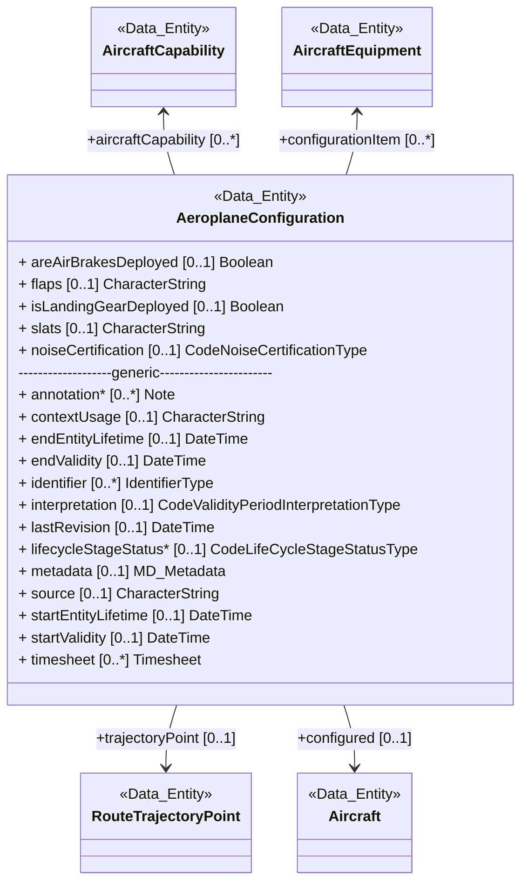
```mermaid	
classDiagram	
class AeroplaneConfiguration	
<<Data_Entity>> AeroplaneConfiguration	
link AeroplaneConfiguration "https://airm.aero/developers/advanced-search/1.0.0/AeroplaneConfiguration?model=LogicalModel" "Go to definition"	
AeroplaneConfiguration : + areAirBrakesDeployed [0..1] Boolean	
AeroplaneConfiguration : + flaps [0..1] CharacterString	
AeroplaneConfiguration : + isLandingGearDeployed [0..1] Boolean	
AeroplaneConfiguration : + slats [0..1] CharacterString	
class RouteTrajectoryPoint	
<<Data_Entity>> RouteTrajectoryPoint	
link RouteTrajectoryPoint "https://airm.aero/developers/advanced-search/1.0.0/RouteTrajectoryPoint?model=LogicalModel" "Go to definition"	
AeroplaneConfiguration --> RouteTrajectoryPoint : +trajectoryPoint [0..1]	
class AircraftCapability	
<<Data_Entity>> AircraftCapability	
link AircraftCapability "https://airm.aero/developers/advanced-search/1.0.0/AircraftCapability?model=LogicalModel" "Go to definition"	
AircraftCapability <-- AeroplaneConfiguration : +aircraftCapability [0..*]	
class AircraftEquipment	
<<Data_Entity>> AircraftEquipment	
link AircraftEquipment "https://airm.aero/developers/advanced-search/1.0.0/AircraftEquipment?model=LogicalModel" "Go to definition"	
AircraftEquipment <-- AeroplaneConfiguration : +configurationItem [0..*]	
class Aircraft	
<<Data_Entity>> Aircraft	
link Aircraft "https://airm.aero/developers/advanced-search/1.0.0/Aircraft?model=LogicalModel" "Go to definition"	
AeroplaneConfiguration --> Aircraft : +configured [0..1]	
AeroplaneConfiguration : + noiseCertification [0..1] CodeNoiseCertificationType	
AeroplaneConfiguration: -------------------generic-----------------------	
AeroplaneConfiguration : + annotation* [0..*] Note	
AeroplaneConfiguration : + contextUsage [0..1] CharacterString	
AeroplaneConfiguration : + endEntityLifetime [0..1] DateTime	
AeroplaneConfiguration : + endValidity [0..1] DateTime	
AeroplaneConfiguration : + identifier [0..*] IdentifierType	
AeroplaneConfiguration : + interpretation [0..1] CodeValidityPeriodInterpretationType	
AeroplaneConfiguration : + lastRevision [0..1] DateTime	
AeroplaneConfiguration : + lifecycleStageStatus* [0..1] CodeLifeCycleStageStatusType	
AeroplaneConfiguration : + metadata [0..1] MD_Metadata	
AeroplaneConfiguration : + source [0..1] CharacterString	
AeroplaneConfiguration : + startEntityLifetime [0..1] DateTime	
AeroplaneConfiguration : + startValidity [0..1] DateTime	
AeroplaneConfiguration : + timesheet [0..*] Timesheet	
```	
	

```mermaid	
classDiagram	
class Aircraft	
<<Data_Entity>> Aircraft	
link Aircraft "https://airm.aero/developers/advanced-search/1.0.0/Aircraft?model=LogicalModel" "Go to definition"	
class AircraftAddress	
<<Data_Entity>> AircraftAddress	
link AircraftAddress "https://airm.aero/developers/advanced-search/1.0.0/AircraftAddress?model=LogicalModel" "Go to definition"	
Aircraft --> AircraftAddress : +aircraftAddress [0..1]	
class AircraftCapability	
<<Data_Entity>> AircraftCapability	
link AircraftCapability "https://airm.aero/developers/advanced-search/1.0.0/AircraftCapability?model=LogicalModel" "Go to definition"	
AircraftCapability <-- Aircraft : +aircraftCapability [0..*]	
class AircraftEquipment	
<<Data_Entity>> AircraftEquipment	
link AircraftEquipment "https://airm.aero/developers/advanced-search/1.0.0/AircraftEquipment?model=LogicalModel" "Go to definition"	
Aircraft --> AircraftEquipment : +aircraftEquipment [0..*]	
class AircraftMakeModelSeries	
<<Data_Object>> AircraftMakeModelSeries	
link AircraftMakeModelSeries "https://airm.aero/developers/advanced-search/1.0.0/AircraftMakeModelSeries?model=LogicalModel" "Go to definition"	
AircraftMakeModelSeries : + make [0..1] CharacterString	
AircraftMakeModelSeries : + model [0..1] CharacterString	
AircraftMakeModelSeries : + series [0..1] CharacterString	
AircraftMakeModelSeries: -------------------generic-----------------------	
AircraftMakeModelSeries : + annotation [0..*] Note	
AircraftMakeModelSeries : + identifier [0..*] IdentifierType	
AircraftMakeModelSeries --o Aircraft : +aircraftModel [0..1]	
class AircraftOperator	
<<Data_Entity>> AircraftOperator	
link AircraftOperator "https://airm.aero/developers/advanced-search/1.0.0/AircraftOperator?model=LogicalModel" "Go to definition"	
Aircraft --> AircraftOperator : +aircraftOperator [0..*]	
Aircraft : + aircraftRegistration [0..1] CharacterString	
class AircraftType	
<<Data_Object>> AircraftType	
link AircraftType "https://airm.aero/developers/advanced-search/1.0.0/AircraftType?model=LogicalModel" "Go to definition"	
AircraftType : + classification [0..1] CodeAircraftClassificationType	
AircraftType : + iataIdentifier [0..1] CharacterString	
AircraftType : + icaoIdentifier [0..1] CharacterString	
AircraftType : + isCargo [0..1] Boolean	
AircraftType : + operationalName [0..1] CharacterString	
AircraftType: -------------------generic-----------------------	
AircraftType : + annotation [0..*] Note	
AircraftType : + identifier [0..*] IdentifierType	
Aircraft o-- AircraftType : +aircraftType [0..1]	
class AircraftCategory	
<<Data_Object>> AircraftCategory	
link AircraftCategory "https://airm.aero/developers/advanced-search/1.0.0/AircraftCategory?model=LogicalModel" "Go to definition"	
AircraftCategory : + aircraftApproachCategory [0..1] CodeAircraftApproachCategoryType	
AircraftCategory : + helicopterClass [0..1] CodeHelicopterPerformanceType	
AircraftCategory : + wakeTurbulenceCategory [0..1] CodeWakeTurbulenceCategoryType	
AircraftCategory : + wakeVortexClassification [0..1] CodeWakeVortexClassificationType	
AircraftCategory: -------------------generic-----------------------	
AircraftCategory : + annotation [0..*] Note	
AircraftCategory : + identifier [0..*] IdentifierType	
AircraftCategory --o Aircraft : +category [0..1]	
class AircraftConfiguration	
<<Data_Entity>> AircraftConfiguration	
link AircraftConfiguration "https://airm.aero/developers/advanced-search/1.0.0/AircraftConfiguration?model=LogicalModel" "Go to definition"	
Aircraft --> AircraftConfiguration : +configuration [0..*]	
class Unit	
<<Data_Entity>> Unit	
link Unit "https://airm.aero/developers/advanced-search/1.0.0/Unit?model=LogicalModel" "Go to definition"	
Unit <-- Aircraft : +currentDataLinkAuthority [0..*]	
class AircraftDimensions	
<<Data_Object>> AircraftDimensions	
link AircraftDimensions "https://airm.aero/developers/advanced-search/1.0.0/AircraftDimensions?model=LogicalModel" "Go to definition"	
AircraftDimensions : + classWingSpan [0..1] CodeAircraftWingspanClassType	
AircraftDimensions : + clearanceMinimaWithBuilding [0..1] ValDistanceType	
AircraftDimensions : + outerMainGearWheelSpan [0..1] ValDistanceType	
AircraftDimensions : + wingSpan [0..1] ValDistanceType	
AircraftDimensions : + wingSpanInterpretation [0..1] CodeValueInterpretationType	
AircraftDimensions: -------------------generic-----------------------	
AircraftDimensions : + annotation [0..*] Note	
AircraftDimensions : + identifier [0..*] IdentifierType	
Aircraft o-- AircraftDimensions : +dimensions [0..1]	
Aircraft : + icaoAircraftCategory [0..1] CodeAircraftType	
Aircraft : + militaryAircraftCallsign [0..1] CharacterString	
class MilitaryAuthority	
<<Data_Entity>> MilitaryAuthority	
link MilitaryAuthority "https://airm.aero/developers/advanced-search/1.0.0/MilitaryAuthority?model=LogicalModel" "Go to definition"	
MilitaryAuthority <-- Aircraft : +militaryAuthority [0..*]	
class Unit	
<<Data_Entity>> Unit	
link Unit "https://airm.aero/developers/advanced-search/1.0.0/Unit?model=LogicalModel" "Go to definition"	
Aircraft --> Unit : +nextTraversedDataLinkAuthority [0..*]	
Aircraft : + passengersInterpretation [0..1] CodeValueInterpretationType	
class Organisation	
<<Data_Entity>> Organisation	
link Organisation "https://airm.aero/developers/advanced-search/1.0.0/Organisation?model=LogicalModel" "Go to definition"	
Aircraft --> Organisation : +registeringAuthority [0..*]	
Aircraft : + selectiveCallingCode [0..1] CharacterString	
class AircraftState	
<<Data_Entity>> AircraftState	
link AircraftState "https://airm.aero/developers/advanced-search/1.0.0/AircraftState?model=LogicalModel" "Go to definition"	
Aircraft --> AircraftState : +state [0..1]	
Aircraft: -------------------generic-----------------------	
Aircraft : + annotation* [0..*] Note	
Aircraft : + contextUsage [0..1] CharacterString	
Aircraft : + endEntityLifetime [0..1] DateTime	
Aircraft : + endValidity [0..1] DateTime	
Aircraft : + identifier [0..*] IdentifierType	
Aircraft : + interpretation [0..1] CodeValidityPeriodInterpretationType	
Aircraft : + lastRevision [0..1] DateTime	
Aircraft : + lifecycleStageStatus* [0..1] CodeLifeCycleStageStatusType	
Aircraft : + metadata [0..1] MD_Metadata	
Aircraft : + source [0..1] CharacterString	
Aircraft : + startEntityLifetime [0..1] DateTime	
Aircraft : + startValidity [0..1] DateTime	
Aircraft : + timesheet [0..*] Timesheet	
```	
	
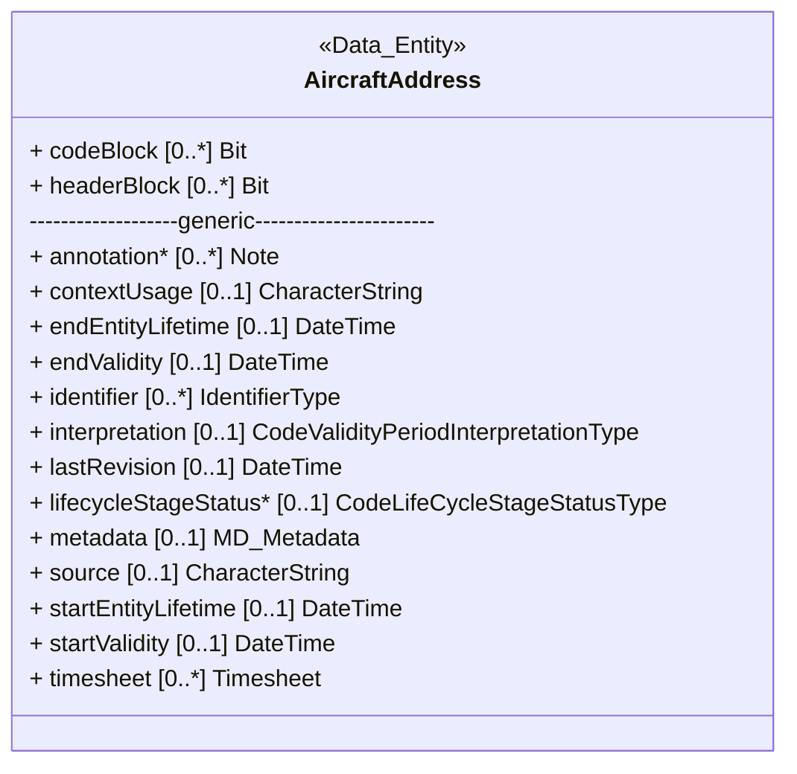
```mermaid	
classDiagram	
class AircraftAddress	
<<Data_Entity>> AircraftAddress	
link AircraftAddress "https://airm.aero/developers/advanced-search/1.0.0/AircraftAddress?model=LogicalModel" "Go to definition"	
AircraftAddress : + codeBlock [0..*] Bit	
AircraftAddress : + headerBlock [0..*] Bit	
AircraftAddress: -------------------generic-----------------------	
AircraftAddress : + annotation* [0..*] Note	
AircraftAddress : + contextUsage [0..1] CharacterString	
AircraftAddress : + endEntityLifetime [0..1] DateTime	
AircraftAddress : + endValidity [0..1] DateTime	
AircraftAddress : + identifier [0..*] IdentifierType	
AircraftAddress : + interpretation [0..1] CodeValidityPeriodInterpretationType	
AircraftAddress : + lastRevision [0..1] DateTime	
AircraftAddress : + lifecycleStageStatus* [0..1] CodeLifeCycleStageStatusType	
AircraftAddress : + metadata [0..1] MD_Metadata	
AircraftAddress : + source [0..1] CharacterString	
AircraftAddress : + startEntityLifetime [0..1] DateTime	
AircraftAddress : + startValidity [0..1] DateTime	
AircraftAddress : + timesheet [0..*] Timesheet	
```	
	
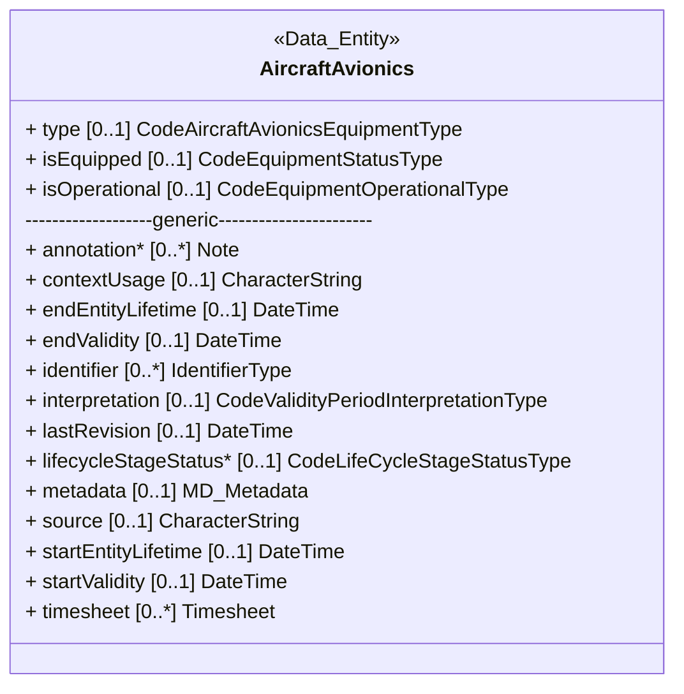
```mermaid	
classDiagram	
class AircraftAvionics	
<<Data_Entity>> AircraftAvionics	
link AircraftAvionics "https://airm.aero/developers/advanced-search/1.0.0/AircraftAvionics?model=LogicalModel" "Go to definition"	
AircraftAvionics : + type [0..1] CodeAircraftAvionicsEquipmentType	
AircraftAvionics : + isEquipped [0..1] CodeEquipmentStatusType	
AircraftAvionics : + isOperational [0..1] CodeEquipmentOperationalType	
AircraftAvionics: -------------------generic-----------------------	
AircraftAvionics : + annotation* [0..*] Note	
AircraftAvionics : + contextUsage [0..1] CharacterString	
AircraftAvionics : + endEntityLifetime [0..1] DateTime	
AircraftAvionics : + endValidity [0..1] DateTime	
AircraftAvionics : + identifier [0..*] IdentifierType	
AircraftAvionics : + interpretation [0..1] CodeValidityPeriodInterpretationType	
AircraftAvionics : + lastRevision [0..1] DateTime	
AircraftAvionics : + lifecycleStageStatus* [0..1] CodeLifeCycleStageStatusType	
AircraftAvionics : + metadata [0..1] MD_Metadata	
AircraftAvionics : + source [0..1] CharacterString	
AircraftAvionics : + startEntityLifetime [0..1] DateTime	
AircraftAvionics : + startValidity [0..1] DateTime	
AircraftAvionics : + timesheet [0..*] Timesheet	
```	
	
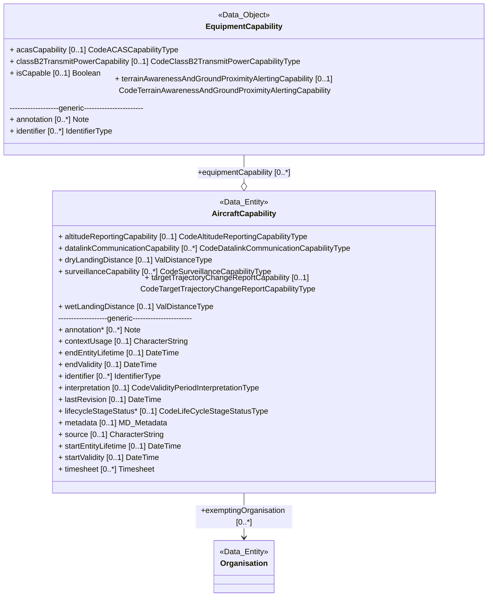
```mermaid	
classDiagram	
class AircraftCapability	
<<Data_Entity>> AircraftCapability	
link AircraftCapability "https://airm.aero/developers/advanced-search/1.0.0/AircraftCapability?model=LogicalModel" "Go to definition"	
AircraftCapability : + altitudeReportingCapability [0..1] CodeAltitudeReportingCapabilityType	
AircraftCapability : + datalinkCommunicationCapability [0..*] CodeDatalinkCommunicationCapabilityType	
AircraftCapability : + dryLandingDistance [0..1] ValDistanceType	
class EquipmentCapability	
<<Data_Object>> EquipmentCapability	
link EquipmentCapability "https://airm.aero/developers/advanced-search/1.0.0/EquipmentCapability?model=LogicalModel" "Go to definition"	
EquipmentCapability : + acasCapability [0..1] CodeACASCapabilityType	
EquipmentCapability : + classB2TransmitPowerCapability [0..1] CodeClassB2TransmitPowerCapabilityType	
EquipmentCapability : + isCapable [0..1] Boolean	
EquipmentCapability : + terrainAwarenessAndGroundProximityAlertingCapability [0..1] CodeTerrainAwarenessAndGroundProximityAlertingCapability	
EquipmentCapability: -------------------generic-----------------------	
EquipmentCapability : + annotation [0..*] Note	
EquipmentCapability : + identifier [0..*] IdentifierType	
EquipmentCapability --o AircraftCapability : +equipmentCapability [0..*]	
class Organisation	
<<Data_Entity>> Organisation	
link Organisation "https://airm.aero/developers/advanced-search/1.0.0/Organisation?model=LogicalModel" "Go to definition"	
AircraftCapability --> Organisation : +exemptingOrganisation [0..*]	
AircraftCapability : + surveillanceCapability [0..*] CodeSurveillanceCapabilityType	
AircraftCapability : + targetTrajectoryChangeReportCapability [0..1] CodeTargetTrajectoryChangeReportCapabilityType	
AircraftCapability : + wetLandingDistance [0..1] ValDistanceType	
AircraftCapability: -------------------generic-----------------------	
AircraftCapability : + annotation* [0..*] Note	
AircraftCapability : + contextUsage [0..1] CharacterString	
AircraftCapability : + endEntityLifetime [0..1] DateTime	
AircraftCapability : + endValidity [0..1] DateTime	
AircraftCapability : + identifier [0..*] IdentifierType	
AircraftCapability : + interpretation [0..1] CodeValidityPeriodInterpretationType	
AircraftCapability : + lastRevision [0..1] DateTime	
AircraftCapability : + lifecycleStageStatus* [0..1] CodeLifeCycleStageStatusType	
AircraftCapability : + metadata [0..1] MD_Metadata	
AircraftCapability : + source [0..1] CharacterString	
AircraftCapability : + startEntityLifetime [0..1] DateTime	
AircraftCapability : + startValidity [0..1] DateTime	
AircraftCapability : + timesheet [0..*] Timesheet	
```	
	
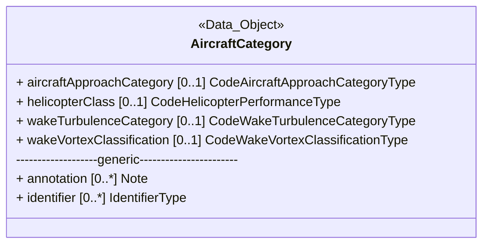
```mermaid	
classDiagram	
class AircraftCategory	
<<Data_Object>> AircraftCategory	
link AircraftCategory "https://airm.aero/developers/advanced-search/1.0.0/AircraftCategory?model=LogicalModel" "Go to definition"	
AircraftCategory : + aircraftApproachCategory [0..1] CodeAircraftApproachCategoryType	
AircraftCategory : + helicopterClass [0..1] CodeHelicopterPerformanceType	
AircraftCategory : + wakeTurbulenceCategory [0..1] CodeWakeTurbulenceCategoryType	
AircraftCategory : + wakeVortexClassification [0..1] CodeWakeVortexClassificationType	
AircraftCategory: -------------------generic-----------------------	
AircraftCategory : + annotation [0..*] Note	
AircraftCategory : + identifier [0..*] IdentifierType	
```	
	
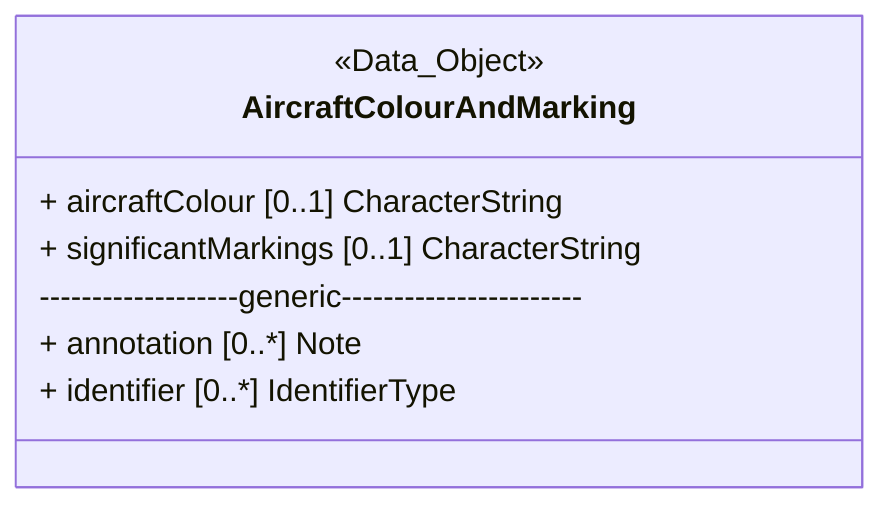
```mermaid	
classDiagram	
class AircraftColourAndMarking	
<<Data_Object>> AircraftColourAndMarking	
link AircraftColourAndMarking "https://airm.aero/developers/advanced-search/1.0.0/AircraftColourAndMarking?model=LogicalModel" "Go to definition"	
AircraftColourAndMarking : + aircraftColour [0..1] CharacterString	
AircraftColourAndMarking : + significantMarkings [0..1] CharacterString	
AircraftColourAndMarking: -------------------generic-----------------------	
AircraftColourAndMarking : + annotation [0..*] Note	
AircraftColourAndMarking : + identifier [0..*] IdentifierType	
```	
	
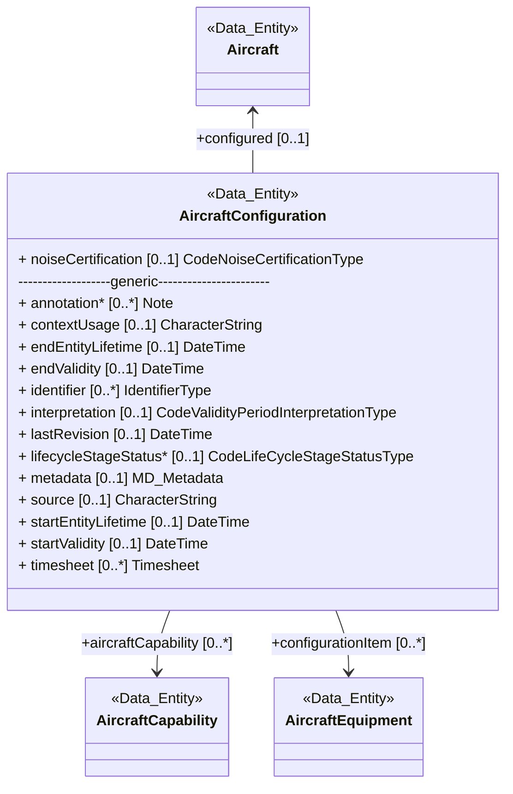
```mermaid	
classDiagram	
class AircraftConfiguration	
<<Data_Entity>> AircraftConfiguration	
link AircraftConfiguration "https://airm.aero/developers/advanced-search/1.0.0/AircraftConfiguration?model=LogicalModel" "Go to definition"	
class AircraftCapability	
<<Data_Entity>> AircraftCapability	
link AircraftCapability "https://airm.aero/developers/advanced-search/1.0.0/AircraftCapability?model=LogicalModel" "Go to definition"	
AircraftConfiguration --> AircraftCapability : +aircraftCapability [0..*]	
class AircraftEquipment	
<<Data_Entity>> AircraftEquipment	
link AircraftEquipment "https://airm.aero/developers/advanced-search/1.0.0/AircraftEquipment?model=LogicalModel" "Go to definition"	
AircraftConfiguration --> AircraftEquipment : +configurationItem [0..*]	
class Aircraft	
<<Data_Entity>> Aircraft	
link Aircraft "https://airm.aero/developers/advanced-search/1.0.0/Aircraft?model=LogicalModel" "Go to definition"	
Aircraft <-- AircraftConfiguration : +configured [0..1]	
AircraftConfiguration : + noiseCertification [0..1] CodeNoiseCertificationType	
AircraftConfiguration: -------------------generic-----------------------	
AircraftConfiguration : + annotation* [0..*] Note	
AircraftConfiguration : + contextUsage [0..1] CharacterString	
AircraftConfiguration : + endEntityLifetime [0..1] DateTime	
AircraftConfiguration : + endValidity [0..1] DateTime	
AircraftConfiguration : + identifier [0..*] IdentifierType	
AircraftConfiguration : + interpretation [0..1] CodeValidityPeriodInterpretationType	
AircraftConfiguration : + lastRevision [0..1] DateTime	
AircraftConfiguration : + lifecycleStageStatus* [0..1] CodeLifeCycleStageStatusType	
AircraftConfiguration : + metadata [0..1] MD_Metadata	
AircraftConfiguration : + source [0..1] CharacterString	
AircraftConfiguration : + startEntityLifetime [0..1] DateTime	
AircraftConfiguration : + startValidity [0..1] DateTime	
AircraftConfiguration : + timesheet [0..*] Timesheet	
```	
	
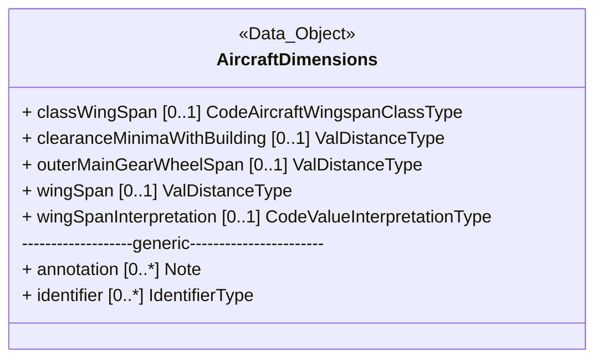
```mermaid	
classDiagram	
class AircraftDimensions	
<<Data_Object>> AircraftDimensions	
link AircraftDimensions "https://airm.aero/developers/advanced-search/1.0.0/AircraftDimensions?model=LogicalModel" "Go to definition"	
AircraftDimensions : + classWingSpan [0..1] CodeAircraftWingspanClassType	
AircraftDimensions : + clearanceMinimaWithBuilding [0..1] ValDistanceType	
AircraftDimensions : + outerMainGearWheelSpan [0..1] ValDistanceType	
AircraftDimensions : + wingSpan [0..1] ValDistanceType	
AircraftDimensions : + wingSpanInterpretation [0..1] CodeValueInterpretationType	
AircraftDimensions: -------------------generic-----------------------	
AircraftDimensions : + annotation [0..*] Note	
AircraftDimensions : + identifier [0..*] IdentifierType	
```	
	
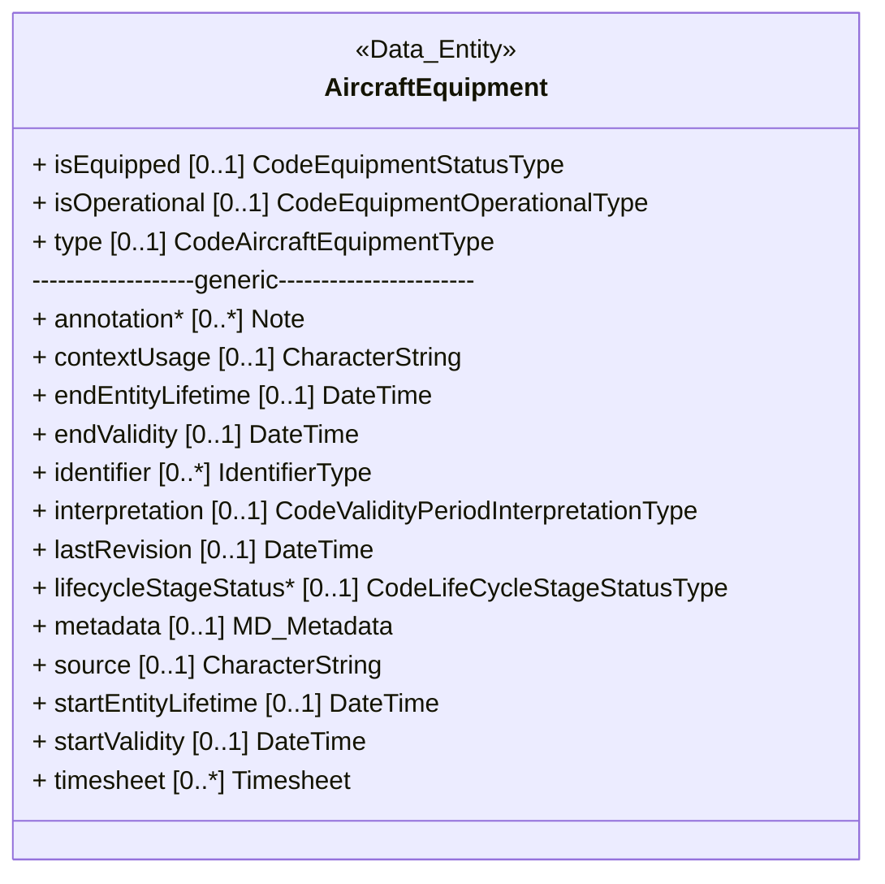
```mermaid	
classDiagram	
class AircraftEquipment	
<<Data_Entity>> AircraftEquipment	
link AircraftEquipment "https://airm.aero/developers/advanced-search/1.0.0/AircraftEquipment?model=LogicalModel" "Go to definition"	
AircraftEquipment : + isEquipped [0..1] CodeEquipmentStatusType	
AircraftEquipment : + isOperational [0..1] CodeEquipmentOperationalType	
AircraftEquipment : + type [0..1] CodeAircraftEquipmentType	
AircraftEquipment: -------------------generic-----------------------	
AircraftEquipment : + annotation* [0..*] Note	
AircraftEquipment : + contextUsage [0..1] CharacterString	
AircraftEquipment : + endEntityLifetime [0..1] DateTime	
AircraftEquipment : + endValidity [0..1] DateTime	
AircraftEquipment : + identifier [0..*] IdentifierType	
AircraftEquipment : + interpretation [0..1] CodeValidityPeriodInterpretationType	
AircraftEquipment : + lastRevision [0..1] DateTime	
AircraftEquipment : + lifecycleStageStatus* [0..1] CodeLifeCycleStageStatusType	
AircraftEquipment : + metadata [0..1] MD_Metadata	
AircraftEquipment : + source [0..1] CharacterString	
AircraftEquipment : + startEntityLifetime [0..1] DateTime	
AircraftEquipment : + startValidity [0..1] DateTime	
AircraftEquipment : + timesheet [0..*] Timesheet	
```	
	
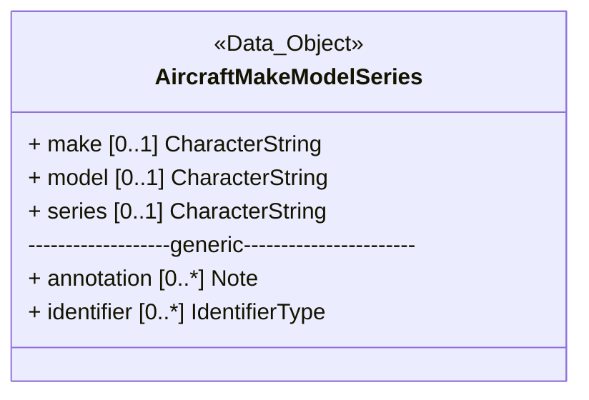
```mermaid	
classDiagram	
class AircraftMakeModelSeries	
<<Data_Object>> AircraftMakeModelSeries	
link AircraftMakeModelSeries "https://airm.aero/developers/advanced-search/1.0.0/AircraftMakeModelSeries?model=LogicalModel" "Go to definition"	
AircraftMakeModelSeries : + make [0..1] CharacterString	
AircraftMakeModelSeries : + model [0..1] CharacterString	
AircraftMakeModelSeries : + series [0..1] CharacterString	
AircraftMakeModelSeries: -------------------generic-----------------------	
AircraftMakeModelSeries : + annotation [0..*] Note	
AircraftMakeModelSeries : + identifier [0..*] IdentifierType	
```	
	
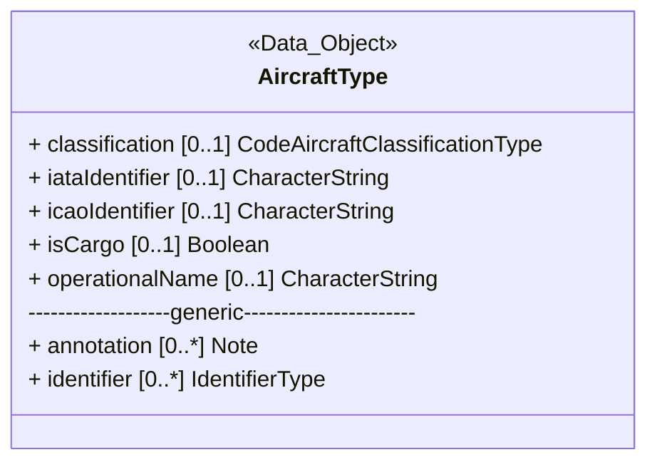
```mermaid	
classDiagram	
class AircraftType	
<<Data_Object>> AircraftType	
link AircraftType "https://airm.aero/developers/advanced-search/1.0.0/AircraftType?model=LogicalModel" "Go to definition"	
AircraftType : + classification [0..1] CodeAircraftClassificationType	
AircraftType : + iataIdentifier [0..1] CharacterString	
AircraftType : + icaoIdentifier [0..1] CharacterString	
AircraftType : + isCargo [0..1] Boolean	
AircraftType : + operationalName [0..1] CharacterString	
AircraftType: -------------------generic-----------------------	
AircraftType : + annotation [0..*] Note	
AircraftType : + identifier [0..*] IdentifierType	
```	
	
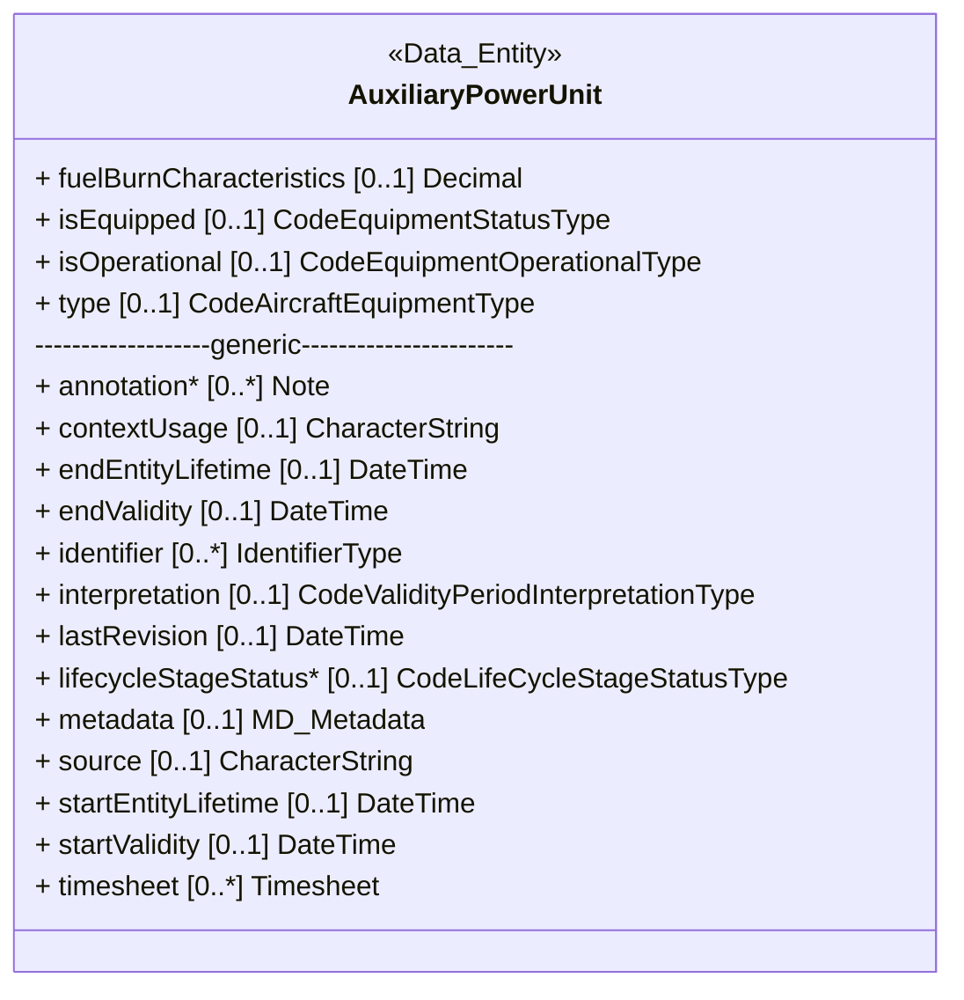
```mermaid	
classDiagram	
class AuxiliaryPowerUnit	
<<Data_Entity>> AuxiliaryPowerUnit	
link AuxiliaryPowerUnit "https://airm.aero/developers/advanced-search/1.0.0/AuxiliaryPowerUnit?model=LogicalModel" "Go to definition"	
AuxiliaryPowerUnit : + fuelBurnCharacteristics [0..1] Decimal	
AuxiliaryPowerUnit : + isEquipped [0..1] CodeEquipmentStatusType	
AuxiliaryPowerUnit : + isOperational [0..1] CodeEquipmentOperationalType	
AuxiliaryPowerUnit : + type [0..1] CodeAircraftEquipmentType	
AuxiliaryPowerUnit: -------------------generic-----------------------	
AuxiliaryPowerUnit : + annotation* [0..*] Note	
AuxiliaryPowerUnit : + contextUsage [0..1] CharacterString	
AuxiliaryPowerUnit : + endEntityLifetime [0..1] DateTime	
AuxiliaryPowerUnit : + endValidity [0..1] DateTime	
AuxiliaryPowerUnit : + identifier [0..*] IdentifierType	
AuxiliaryPowerUnit : + interpretation [0..1] CodeValidityPeriodInterpretationType	
AuxiliaryPowerUnit : + lastRevision [0..1] DateTime	
AuxiliaryPowerUnit : + lifecycleStageStatus* [0..1] CodeLifeCycleStageStatusType	
AuxiliaryPowerUnit : + metadata [0..1] MD_Metadata	
AuxiliaryPowerUnit : + source [0..1] CharacterString	
AuxiliaryPowerUnit : + startEntityLifetime [0..1] DateTime	
AuxiliaryPowerUnit : + startValidity [0..1] DateTime	
AuxiliaryPowerUnit : + timesheet [0..*] Timesheet	
```	
	
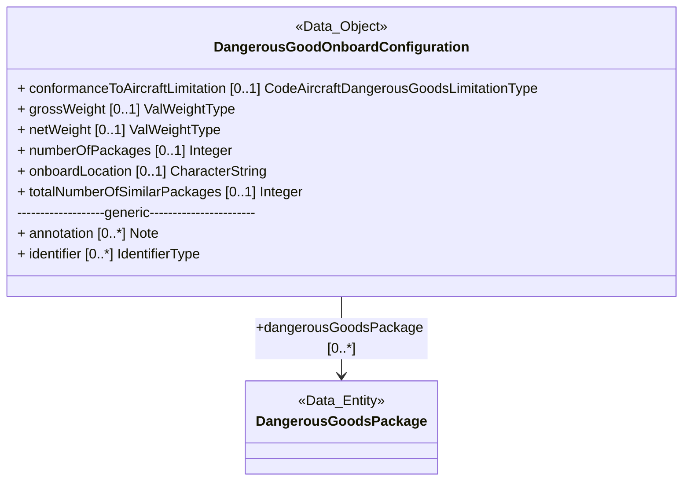
```mermaid	
classDiagram	
class DangerousGoodOnboardConfiguration	
<<Data_Object>> DangerousGoodOnboardConfiguration	
link DangerousGoodOnboardConfiguration "https://airm.aero/developers/advanced-search/1.0.0/DangerousGoodOnboardConfiguration?model=LogicalModel" "Go to definition"	
DangerousGoodOnboardConfiguration : + conformanceToAircraftLimitation [0..1] CodeAircraftDangerousGoodsLimitationType	
class DangerousGoodsPackage	
<<Data_Entity>> DangerousGoodsPackage	
link DangerousGoodsPackage "https://airm.aero/developers/advanced-search/1.0.0/DangerousGoodsPackage?model=LogicalModel" "Go to definition"	
DangerousGoodOnboardConfiguration --> DangerousGoodsPackage : +dangerousGoodsPackage [0..*]	
DangerousGoodOnboardConfiguration : + grossWeight [0..1] ValWeightType	
DangerousGoodOnboardConfiguration : + netWeight [0..1] ValWeightType	
DangerousGoodOnboardConfiguration : + numberOfPackages [0..1] Integer	
DangerousGoodOnboardConfiguration : + onboardLocation [0..1] CharacterString	
DangerousGoodOnboardConfiguration : + totalNumberOfSimilarPackages [0..1] Integer	
DangerousGoodOnboardConfiguration: -------------------generic-----------------------	
DangerousGoodOnboardConfiguration : + annotation [0..*] Note	
DangerousGoodOnboardConfiguration : + identifier [0..*] IdentifierType	
```	
	
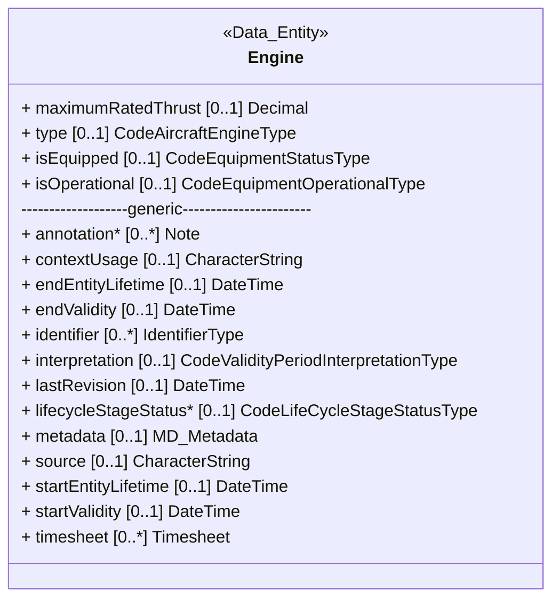
```mermaid	
classDiagram	
class Engine	
<<Data_Entity>> Engine	
link Engine "https://airm.aero/developers/advanced-search/1.0.0/Engine?model=LogicalModel" "Go to definition"	
Engine : + maximumRatedThrust [0..1] Decimal	
Engine : + type [0..1] CodeAircraftEngineType	
Engine : + isEquipped [0..1] CodeEquipmentStatusType	
Engine : + isOperational [0..1] CodeEquipmentOperationalType	
Engine: -------------------generic-----------------------	
Engine : + annotation* [0..*] Note	
Engine : + contextUsage [0..1] CharacterString	
Engine : + endEntityLifetime [0..1] DateTime	
Engine : + endValidity [0..1] DateTime	
Engine : + identifier [0..*] IdentifierType	
Engine : + interpretation [0..1] CodeValidityPeriodInterpretationType	
Engine : + lastRevision [0..1] DateTime	
Engine : + lifecycleStageStatus* [0..1] CodeLifeCycleStageStatusType	
Engine : + metadata [0..1] MD_Metadata	
Engine : + source [0..1] CharacterString	
Engine : + startEntityLifetime [0..1] DateTime	
Engine : + startValidity [0..1] DateTime	
Engine : + timesheet [0..*] Timesheet	
```	
	
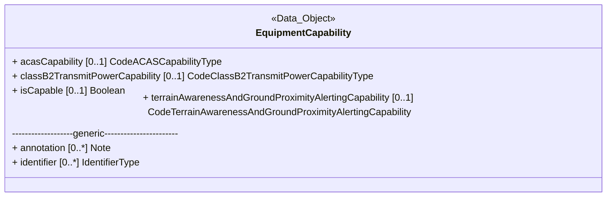
```mermaid	
classDiagram	
class EquipmentCapability	
<<Data_Object>> EquipmentCapability	
link EquipmentCapability "https://airm.aero/developers/advanced-search/1.0.0/EquipmentCapability?model=LogicalModel" "Go to definition"	
EquipmentCapability : + acasCapability [0..1] CodeACASCapabilityType	
EquipmentCapability : + classB2TransmitPowerCapability [0..1] CodeClassB2TransmitPowerCapabilityType	
EquipmentCapability : + isCapable [0..1] Boolean	
EquipmentCapability : + terrainAwarenessAndGroundProximityAlertingCapability [0..1] CodeTerrainAwarenessAndGroundProximityAlertingCapability	
EquipmentCapability: -------------------generic-----------------------	
EquipmentCapability : + annotation [0..*] Note	
EquipmentCapability : + identifier [0..*] IdentifierType	
```	
	
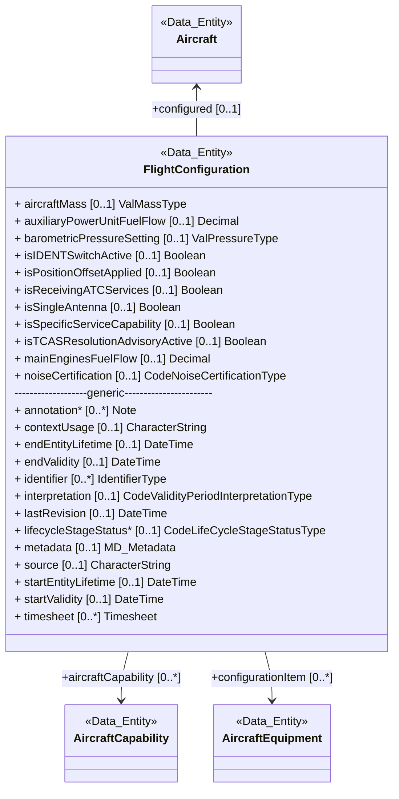
```mermaid	
classDiagram	
class FlightConfiguration	
<<Data_Entity>> FlightConfiguration	
link FlightConfiguration "https://airm.aero/developers/advanced-search/1.0.0/FlightConfiguration?model=LogicalModel" "Go to definition"	
FlightConfiguration : + aircraftMass [0..1] ValMassType	
FlightConfiguration : + auxiliaryPowerUnitFuelFlow [0..1] Decimal	
FlightConfiguration : + barometricPressureSetting [0..1] ValPressureType	
FlightConfiguration : + isIDENTSwitchActive [0..1] Boolean	
FlightConfiguration : + isPositionOffsetApplied [0..1] Boolean	
FlightConfiguration : + isReceivingATCServices [0..1] Boolean	
FlightConfiguration : + isSingleAntenna [0..1] Boolean	
FlightConfiguration : + isSpecificServiceCapability [0..1] Boolean	
FlightConfiguration : + isTCASResolutionAdvisoryActive [0..1] Boolean	
FlightConfiguration : + mainEnginesFuelFlow [0..1] Decimal	
class AircraftCapability	
<<Data_Entity>> AircraftCapability	
link AircraftCapability "https://airm.aero/developers/advanced-search/1.0.0/AircraftCapability?model=LogicalModel" "Go to definition"	
FlightConfiguration --> AircraftCapability : +aircraftCapability [0..*]	
class AircraftEquipment	
<<Data_Entity>> AircraftEquipment	
link AircraftEquipment "https://airm.aero/developers/advanced-search/1.0.0/AircraftEquipment?model=LogicalModel" "Go to definition"	
FlightConfiguration --> AircraftEquipment : +configurationItem [0..*]	
class Aircraft	
<<Data_Entity>> Aircraft	
link Aircraft "https://airm.aero/developers/advanced-search/1.0.0/Aircraft?model=LogicalModel" "Go to definition"	
Aircraft <-- FlightConfiguration : +configured [0..1]	
FlightConfiguration : + noiseCertification [0..1] CodeNoiseCertificationType	
FlightConfiguration: -------------------generic-----------------------	
FlightConfiguration : + annotation* [0..*] Note	
FlightConfiguration : + contextUsage [0..1] CharacterString	
FlightConfiguration : + endEntityLifetime [0..1] DateTime	
FlightConfiguration : + endValidity [0..1] DateTime	
FlightConfiguration : + identifier [0..*] IdentifierType	
FlightConfiguration : + interpretation [0..1] CodeValidityPeriodInterpretationType	
FlightConfiguration : + lastRevision [0..1] DateTime	
FlightConfiguration : + lifecycleStageStatus* [0..1] CodeLifeCycleStageStatusType	
FlightConfiguration : + metadata [0..1] MD_Metadata	
FlightConfiguration : + source [0..1] CharacterString	
FlightConfiguration : + startEntityLifetime [0..1] DateTime	
FlightConfiguration : + startValidity [0..1] DateTime	
FlightConfiguration : + timesheet [0..*] Timesheet	
```	
	
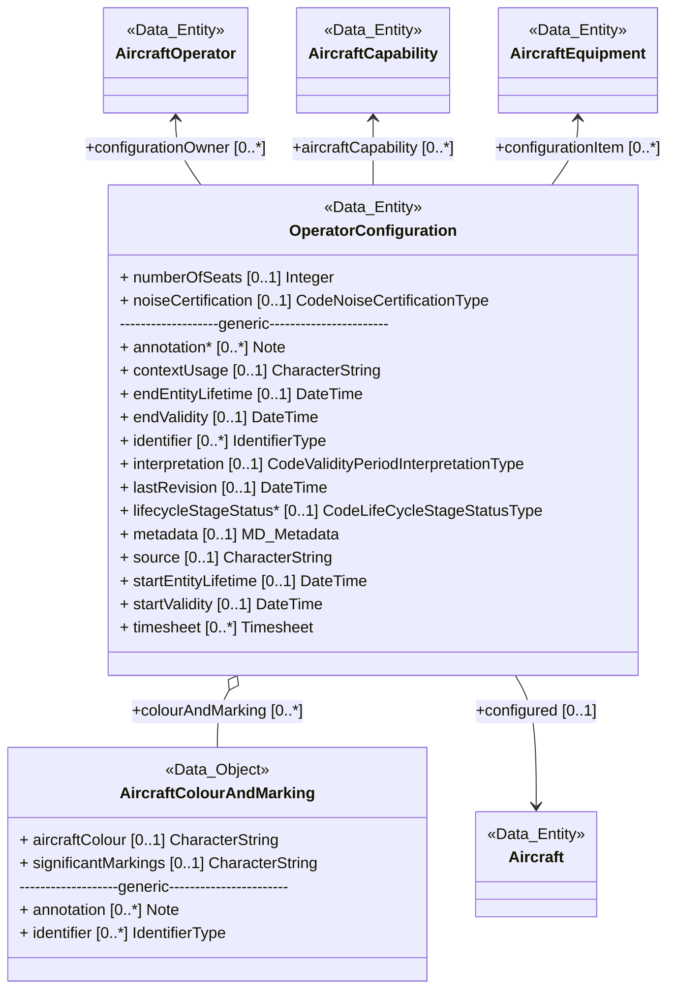
```mermaid	
classDiagram	
class OperatorConfiguration	
<<Data_Entity>> OperatorConfiguration	
link OperatorConfiguration "https://airm.aero/developers/advanced-search/1.0.0/OperatorConfiguration?model=LogicalModel" "Go to definition"	
class AircraftColourAndMarking	
<<Data_Object>> AircraftColourAndMarking	
link AircraftColourAndMarking "https://airm.aero/developers/advanced-search/1.0.0/AircraftColourAndMarking?model=LogicalModel" "Go to definition"	
AircraftColourAndMarking : + aircraftColour [0..1] CharacterString	
AircraftColourAndMarking : + significantMarkings [0..1] CharacterString	
AircraftColourAndMarking: -------------------generic-----------------------	
AircraftColourAndMarking : + annotation [0..*] Note	
AircraftColourAndMarking : + identifier [0..*] IdentifierType	
OperatorConfiguration o-- AircraftColourAndMarking : +colourAndMarking [0..*]	
class AircraftOperator	
<<Data_Entity>> AircraftOperator	
link AircraftOperator "https://airm.aero/developers/advanced-search/1.0.0/AircraftOperator?model=LogicalModel" "Go to definition"	
AircraftOperator <-- OperatorConfiguration : +configurationOwner [0..*]	
OperatorConfiguration : + numberOfSeats [0..1] Integer	
class AircraftCapability	
<<Data_Entity>> AircraftCapability	
link AircraftCapability "https://airm.aero/developers/advanced-search/1.0.0/AircraftCapability?model=LogicalModel" "Go to definition"	
AircraftCapability <-- OperatorConfiguration : +aircraftCapability [0..*]	
class AircraftEquipment	
<<Data_Entity>> AircraftEquipment	
link AircraftEquipment "https://airm.aero/developers/advanced-search/1.0.0/AircraftEquipment?model=LogicalModel" "Go to definition"	
AircraftEquipment <-- OperatorConfiguration : +configurationItem [0..*]	
class Aircraft	
<<Data_Entity>> Aircraft	
link Aircraft "https://airm.aero/developers/advanced-search/1.0.0/Aircraft?model=LogicalModel" "Go to definition"	
OperatorConfiguration --> Aircraft : +configured [0..1]	
OperatorConfiguration : + noiseCertification [0..1] CodeNoiseCertificationType	
OperatorConfiguration: -------------------generic-----------------------	
OperatorConfiguration : + annotation* [0..*] Note	
OperatorConfiguration : + contextUsage [0..1] CharacterString	
OperatorConfiguration : + endEntityLifetime [0..1] DateTime	
OperatorConfiguration : + endValidity [0..1] DateTime	
OperatorConfiguration : + identifier [0..*] IdentifierType	
OperatorConfiguration : + interpretation [0..1] CodeValidityPeriodInterpretationType	
OperatorConfiguration : + lastRevision [0..1] DateTime	
OperatorConfiguration : + lifecycleStageStatus* [0..1] CodeLifeCycleStageStatusType	
OperatorConfiguration : + metadata [0..1] MD_Metadata	
OperatorConfiguration : + source [0..1] CharacterString	
OperatorConfiguration : + startEntityLifetime [0..1] DateTime	
OperatorConfiguration : + startValidity [0..1] DateTime	
OperatorConfiguration : + timesheet [0..*] Timesheet	
```	
	
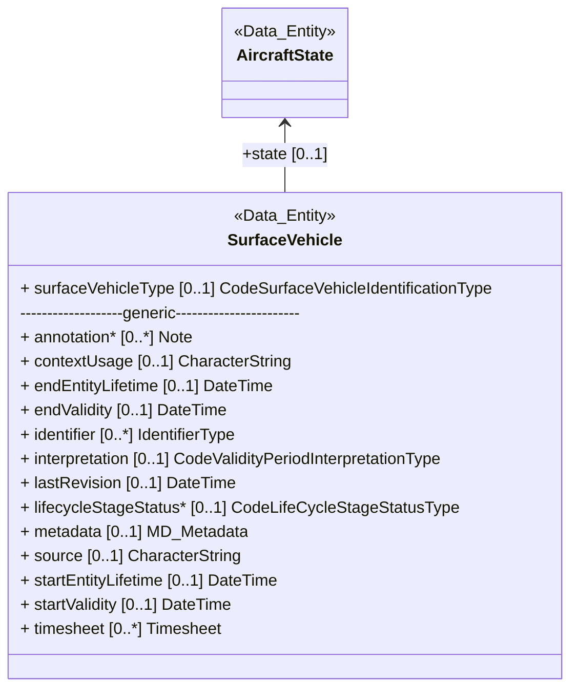
```mermaid	
classDiagram	
class SurfaceVehicle	
<<Data_Entity>> SurfaceVehicle	
link SurfaceVehicle "https://airm.aero/developers/advanced-search/1.0.0/SurfaceVehicle?model=LogicalModel" "Go to definition"	
SurfaceVehicle : + surfaceVehicleType [0..1] CodeSurfaceVehicleIdentificationType	
class AircraftState	
<<Data_Entity>> AircraftState	
link AircraftState "https://airm.aero/developers/advanced-search/1.0.0/AircraftState?model=LogicalModel" "Go to definition"	
AircraftState <-- SurfaceVehicle : +state [0..1]	
SurfaceVehicle: -------------------generic-----------------------	
SurfaceVehicle : + annotation* [0..*] Note	
SurfaceVehicle : + contextUsage [0..1] CharacterString	
SurfaceVehicle : + endEntityLifetime [0..1] DateTime	
SurfaceVehicle : + endValidity [0..1] DateTime	
SurfaceVehicle : + identifier [0..*] IdentifierType	
SurfaceVehicle : + interpretation [0..1] CodeValidityPeriodInterpretationType	
SurfaceVehicle : + lastRevision [0..1] DateTime	
SurfaceVehicle : + lifecycleStageStatus* [0..1] CodeLifeCycleStageStatusType	
SurfaceVehicle : + metadata [0..1] MD_Metadata	
SurfaceVehicle : + source [0..1] CharacterString	
SurfaceVehicle : + startEntityLifetime [0..1] DateTime	
SurfaceVehicle : + startValidity [0..1] DateTime	
SurfaceVehicle : + timesheet [0..*] Timesheet	
```	
	
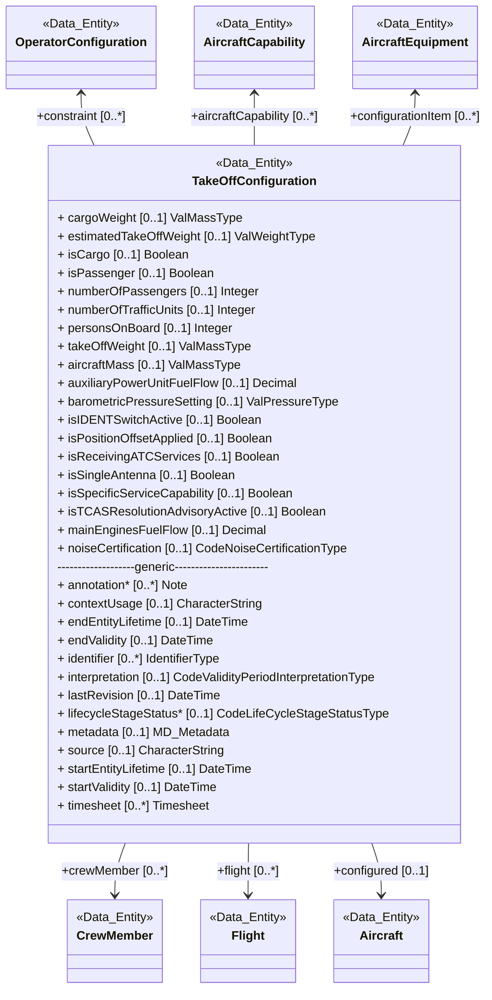
```mermaid	
classDiagram	
class TakeOffConfiguration	
<<Data_Entity>> TakeOffConfiguration	
link TakeOffConfiguration "https://airm.aero/developers/advanced-search/1.0.0/TakeOffConfiguration?model=LogicalModel" "Go to definition"	
TakeOffConfiguration : + cargoWeight [0..1] ValMassType	
class OperatorConfiguration	
<<Data_Entity>> OperatorConfiguration	
link OperatorConfiguration "https://airm.aero/developers/advanced-search/1.0.0/OperatorConfiguration?model=LogicalModel" "Go to definition"	
OperatorConfiguration <-- TakeOffConfiguration : +constraint [0..*]	
class CrewMember	
<<Data_Entity>> CrewMember	
link CrewMember "https://airm.aero/developers/advanced-search/1.0.0/CrewMember?model=LogicalModel" "Go to definition"	
TakeOffConfiguration --> CrewMember : +crewMember [0..*]	
TakeOffConfiguration : + estimatedTakeOffWeight [0..1] ValWeightType	
class Flight	
<<Data_Entity>> Flight	
link Flight "https://airm.aero/developers/advanced-search/1.0.0/Flight?model=LogicalModel" "Go to definition"	
TakeOffConfiguration --> Flight : +flight [0..*]	
TakeOffConfiguration : + isCargo [0..1] Boolean	
TakeOffConfiguration : + isPassenger [0..1] Boolean	
TakeOffConfiguration : + numberOfPassengers [0..1] Integer	
TakeOffConfiguration : + numberOfTrafficUnits [0..1] Integer	
TakeOffConfiguration : + personsOnBoard [0..1] Integer	
TakeOffConfiguration : + takeOffWeight [0..1] ValMassType	
TakeOffConfiguration : + aircraftMass [0..1] ValMassType	
TakeOffConfiguration : + auxiliaryPowerUnitFuelFlow [0..1] Decimal	
TakeOffConfiguration : + barometricPressureSetting [0..1] ValPressureType	
TakeOffConfiguration : + isIDENTSwitchActive [0..1] Boolean	
TakeOffConfiguration : + isPositionOffsetApplied [0..1] Boolean	
TakeOffConfiguration : + isReceivingATCServices [0..1] Boolean	
TakeOffConfiguration : + isSingleAntenna [0..1] Boolean	
TakeOffConfiguration : + isSpecificServiceCapability [0..1] Boolean	
TakeOffConfiguration : + isTCASResolutionAdvisoryActive [0..1] Boolean	
TakeOffConfiguration : + mainEnginesFuelFlow [0..1] Decimal	
class AircraftCapability	
<<Data_Entity>> AircraftCapability	
link AircraftCapability "https://airm.aero/developers/advanced-search/1.0.0/AircraftCapability?model=LogicalModel" "Go to definition"	
AircraftCapability <-- TakeOffConfiguration : +aircraftCapability [0..*]	
class AircraftEquipment	
<<Data_Entity>> AircraftEquipment	
link AircraftEquipment "https://airm.aero/developers/advanced-search/1.0.0/AircraftEquipment?model=LogicalModel" "Go to definition"	
AircraftEquipment <-- TakeOffConfiguration : +configurationItem [0..*]	
class Aircraft	
<<Data_Entity>> Aircraft	
link Aircraft "https://airm.aero/developers/advanced-search/1.0.0/Aircraft?model=LogicalModel" "Go to definition"	
TakeOffConfiguration --> Aircraft : +configured [0..1]	
TakeOffConfiguration : + noiseCertification [0..1] CodeNoiseCertificationType	
TakeOffConfiguration: -------------------generic-----------------------	
TakeOffConfiguration : + annotation* [0..*] Note	
TakeOffConfiguration : + contextUsage [0..1] CharacterString	
TakeOffConfiguration : + endEntityLifetime [0..1] DateTime	
TakeOffConfiguration : + endValidity [0..1] DateTime	
TakeOffConfiguration : + identifier [0..*] IdentifierType	
TakeOffConfiguration : + interpretation [0..1] CodeValidityPeriodInterpretationType	
TakeOffConfiguration : + lastRevision [0..1] DateTime	
TakeOffConfiguration : + lifecycleStageStatus* [0..1] CodeLifeCycleStageStatusType	
TakeOffConfiguration : + metadata [0..1] MD_Metadata	
TakeOffConfiguration : + source [0..1] CharacterString	
TakeOffConfiguration : + startEntityLifetime [0..1] DateTime	
TakeOffConfiguration : + startValidity [0..1] DateTime	
TakeOffConfiguration : + timesheet [0..*] Timesheet	
```	
	
```mermaid	
classDiagram	
class Vehicle	
<<Data_Entity>> Vehicle	
link Vehicle "https://airm.aero/developers/advanced-search/1.0.0/Vehicle?model=LogicalModel" "Go to definition"	
class AircraftState	
<<Data_Entity>> AircraftState	
link AircraftState "https://airm.aero/developers/advanced-search/1.0.0/AircraftState?model=LogicalModel" "Go to definition"	
Vehicle --> AircraftState : +state [0..1]	
Vehicle: -------------------generic-----------------------	
Vehicle : + annotation* [0..*] Note	
Vehicle : + contextUsage [0..1] CharacterString	
Vehicle : + endEntityLifetime [0..1] DateTime	
Vehicle : + endValidity [0..1] DateTime	
Vehicle : + identifier [0..*] IdentifierType	
Vehicle : + interpretation [0..1] CodeValidityPeriodInterpretationType	
Vehicle : + lastRevision [0..1] DateTime	
Vehicle : + lifecycleStageStatus* [0..1] CodeLifeCycleStageStatusType	
Vehicle : + metadata [0..1] MD_Metadata	
Vehicle : + source [0..1] CharacterString	
Vehicle : + startEntityLifetime [0..1] DateTime	
Vehicle : + startValidity [0..1] DateTime	
Vehicle : + timesheet [0..*] Timesheet	
```	
	
```mermaid	
classDiagram	
class CodeACASCapabilityType	
<<CodeList>> CodeACASCapabilityType	
CodeACASCapabilityType : + AIRCRAFT_IDENTIFICATION_CAPABILITY	
CodeACASCapabilityType : + B1A	
CodeACASCapabilityType : + B1B	
```	
	
```mermaid	
classDiagram	
class CodeAircraftApproachCategoryType	
<<CodeList>> CodeAircraftApproachCategoryType	
CodeAircraftApproachCategoryType : + A	
CodeAircraftApproachCategoryType : + ALL	
CodeAircraftApproachCategoryType : + B	
CodeAircraftApproachCategoryType : + C	
CodeAircraftApproachCategoryType : + D	
CodeAircraftApproachCategoryType : + E	
CodeAircraftApproachCategoryType : + H	
```	
	
```mermaid	
classDiagram	
class CodeAircraftAvionicsEquipmentType	
<<CodeList>> CodeAircraftAvionicsEquipmentType	
CodeAircraftAvionicsEquipmentType : + AIRBORNE_COLLISION_AVOIDANCE_SYSTEM_I	
CodeAircraftAvionicsEquipmentType : + AIRBORNE_COLLISION_AVOIDANCE_SYSTEM_II	
CodeAircraftAvionicsEquipmentType : + AIRBORNE_SEPARATION_ASSURANCE_SYSTEM	
CodeAircraftAvionicsEquipmentType : + AUTOMATIC_DIRECTION_FINDER	
CodeAircraftAvionicsEquipmentType : + COCKPIT_DISPLAY_OF_SURFACE_TRAFFIC_INFORMATION	
CodeAircraftAvionicsEquipmentType : + COCKPIT_DISPLAY_OF_TRAFFIC_INFORMATION	
CodeAircraftAvionicsEquipmentType : + ENHANCED_VISION_SYSTEM	
CodeAircraftAvionicsEquipmentType : + GROUND_PROXIMITY_WARNING_SYSTEM	
CodeAircraftAvionicsEquipmentType : + INERTIAL_NAVIGATION_SYSTEM	
CodeAircraftAvionicsEquipmentType : + SURFACE_MOVING_MAP_DISPLAY	
CodeAircraftAvionicsEquipmentType : + SYNTHETIC_VISION_SYSTEM	
CodeAircraftAvionicsEquipmentType : + TERRAIN_AVOIDANCE_AND_WARNING_SYSTEM	
CodeAircraftAvionicsEquipmentType : + TRAFFIC_ALERT_AND_COLLISION_AVOIDANCE_SYSTEM_I	
CodeAircraftAvionicsEquipmentType : + TRAFFIC_ALERT_AND_COLLISION_AVOIDANCE_SYSTEM_II_VERSION_7	
```	
	
```mermaid	
classDiagram	
class CodeAircraftClassificationType	
<<CodeList>> CodeAircraftClassificationType	
CodeAircraftClassificationType : + CLEARANCE	
CodeAircraftClassificationType : + ENGINE_NUMBER	
CodeAircraftClassificationType : + ENGINE_TYPE	
CodeAircraftClassificationType : + MINIMUM_APPROACH_SPEED	
CodeAircraftClassificationType : + MTOW	
CodeAircraftClassificationType : + OUTER_GEAR_SPAN	
CodeAircraftClassificationType : + WING_SPAN	
```	
	
```mermaid	
classDiagram	
class CodeAircraftEngineNumberType	
<<CodeList>> CodeAircraftEngineNumberType	
CodeAircraftEngineNumberType : + 0	
CodeAircraftEngineNumberType : + 1	
CodeAircraftEngineNumberType : + 2	
CodeAircraftEngineNumberType : + 2C	
CodeAircraftEngineNumberType : + 3	
CodeAircraftEngineNumberType : + 4	
CodeAircraftEngineNumberType : + 6	
CodeAircraftEngineNumberType : + 8	
```	
	
```mermaid	
classDiagram	
class CodeAircraftEngineType	
<<CodeList>> CodeAircraftEngineType	
CodeAircraftEngineType : + ELECTRIC	
CodeAircraftEngineType : + PISTON	
CodeAircraftEngineType : + TURBO_FAN	
CodeAircraftEngineType : + TURBO_JET	
CodeAircraftEngineType : + TURBO_PROP	
```	
	
```mermaid	
classDiagram	
class CodeAircraftEquipmentType	
<<CodeList>> CodeAircraftEquipmentType	
CodeAircraftEquipmentType : + EMERGENCY_LOCATOR_TRANSMITTER	
```	
	
```mermaid	
classDiagram	
class CodeAircraftSurvivalEquipmentType	
<<CodeList>> CodeAircraftSurvivalEquipmentType	
CodeAircraftSurvivalEquipmentType : + DINGHY	
CodeAircraftSurvivalEquipmentType : + LIFE_JACKET	
```	
	
```mermaid	
classDiagram	
class CodeAircraftType	
<<CodeList>> CodeAircraftType	
CodeAircraftType : + AEROPLANE	
CodeAircraftType : + AIRSHIP	
CodeAircraftType : + BALLOON	
CodeAircraftType : + GLIDER	
CodeAircraftType : + GYROPLANE	
CodeAircraftType : + HELICOPTER	
CodeAircraftType : + ORNITHOPTER	
CodeAircraftType : + POWERED_LIFT	
CodeAircraftType : + ROTORCRAFT	
CodeAircraftType : + SELF_SUSTAINING_POWERED_SAILPLANE	
CodeAircraftType : + UNMANNED_AIRCRAFT	
CodeAircraftType : + UNMANNED_FREE_BALLOON	
```	
	
```mermaid	
classDiagram	
class CodeAircraftWingspanClassType	
<<CodeList>> CodeAircraftWingspanClassType	
CodeAircraftWingspanClassType : + A	
CodeAircraftWingspanClassType : + B	
CodeAircraftWingspanClassType : + C	
CodeAircraftWingspanClassType : + D	
CodeAircraftWingspanClassType : + E	
CodeAircraftWingspanClassType : + F	
```	
	
```mermaid	
classDiagram	
class CodeAltitudeReportingCapabilityType	
<<CodeList>> CodeAltitudeReportingCapabilityType	
CodeAltitudeReportingCapabilityType : + 100_FT	
CodeAltitudeReportingCapabilityType : + 25_FT	
CodeAltitudeReportingCapabilityType : + INVALID	
CodeAltitudeReportingCapabilityType : + UNKNOWN	
```	
	
```mermaid	
classDiagram	
class CodeClassB2TransmitPowerCapabilityType	
<<CodeList>> CodeClassB2TransmitPowerCapabilityType	
CodeClassB2TransmitPowerCapabilityType : + GREATER_THAN_OR_EQUAL_TO_70_WATTS	
CodeClassB2TransmitPowerCapabilityType : + LESS_THAN_70_WATTS	
```	
	
```mermaid	
classDiagram	
class CodeDatalinkCommunicationCapabilityType	
<<CodeList>> CodeDatalinkCommunicationCapabilityType	
CodeDatalinkCommunicationCapabilityType : + CPDLC_ATN_VDL_MODE_2	
CodeDatalinkCommunicationCapabilityType : + CPDLC_FANS_1/A_HFDL	
CodeDatalinkCommunicationCapabilityType : + CPDLC_FANS_1/A_SATCOM_INMARSAT	
CodeDatalinkCommunicationCapabilityType : + CPDLC_FANS_1/A_SATCOM_IRIDIUM	
CodeDatalinkCommunicationCapabilityType : + CPDLC_FANS_1/A_SATCOM_MTSAT	
CodeDatalinkCommunicationCapabilityType : + CPDLC_FANS_1/A_VDL_MODE_2	
CodeDatalinkCommunicationCapabilityType : + CPDLC_FANS_1/A_VDL_MODE_4	
CodeDatalinkCommunicationCapabilityType : + CPDLC_FANS_1/A_VDL_MODE_A	
CodeDatalinkCommunicationCapabilityType : + CPDLC_OVER_VDL_MODE_3	
CodeDatalinkCommunicationCapabilityType : + CPDLC_OVER_VDL_MODE_4	
CodeDatalinkCommunicationCapabilityType : + CPDLC_RTCA_SC_214	
CodeDatalinkCommunicationCapabilityType : + FANS_1A/ACARS_DATA_LINK	
```	
	
```mermaid	
classDiagram	
class CodeEquipmentStatusType	
<<CodeList>> CodeEquipmentStatusType	
CodeEquipmentStatusType : + EQUIPPED	
CodeEquipmentStatusType : + NOT_EQUIPPED	
CodeEquipmentStatusType : + UNKNOWN	
```	
	
```mermaid	
classDiagram	
class CodeHelicopterPerformanceType	
<<CodeList>> CodeHelicopterPerformanceType	
CodeHelicopterPerformanceType : + 1	
CodeHelicopterPerformanceType : + 2	
CodeHelicopterPerformanceType : + 3	
```	
	
```mermaid	
classDiagram	
class CodeLifeJacketEquipmentType	
<<CodeList>> CodeLifeJacketEquipmentType	
CodeLifeJacketEquipmentType : + F	
CodeLifeJacketEquipmentType : + L	
CodeLifeJacketEquipmentType : + U	
CodeLifeJacketEquipmentType : + V	
```	
	
```mermaid	
classDiagram	
class CodeNoiseCertificationType	
<<CodeList>> CodeNoiseCertificationType	
CodeNoiseCertificationType : + CHAPTER_10	
CodeNoiseCertificationType : + CHAPTER_11	
CodeNoiseCertificationType : + CHAPTER_12	
CodeNoiseCertificationType : + CHAPTER_13	
CodeNoiseCertificationType : + CHAPTER_2	
CodeNoiseCertificationType : + CHAPTER_3	
CodeNoiseCertificationType : + CHAPTER_4	
CodeNoiseCertificationType : + CHAPTER_5	
CodeNoiseCertificationType : + CHAPTER_6	
CodeNoiseCertificationType : + CHAPTER_7	
CodeNoiseCertificationType : + CHAPTER_8	
CodeNoiseCertificationType : + CHAPTER_9	
```	
	
```mermaid	
classDiagram	
class CodeSurfaceVehicleIdentificationType	
<<CodeList>> CodeSurfaceVehicleIdentificationType	
CodeSurfaceVehicleIdentificationType : + AIRCRAFT_MAINTENANCE	
CodeSurfaceVehicleIdentificationType : + AIRPORT_MAINTENANCE	
CodeSurfaceVehicleIdentificationType : + ATC_EQUIPMENT_MAINTENANCE	
CodeSurfaceVehicleIdentificationType : + BAGGAGE	
CodeSurfaceVehicleIdentificationType : + BIRD_SCARER	
CodeSurfaceVehicleIdentificationType : + BUS	
CodeSurfaceVehicleIdentificationType : + CATERING	
CodeSurfaceVehicleIdentificationType : + EMERGENCY	
CodeSurfaceVehicleIdentificationType : + FIRE	
CodeSurfaceVehicleIdentificationType : + FOLLOW_ME	
CodeSurfaceVehicleIdentificationType : + FUEL	
CodeSurfaceVehicleIdentificationType : + GRASS_CUTTER	
CodeSurfaceVehicleIdentificationType : + POLICE	
CodeSurfaceVehicleIdentificationType : + RUNWAY_SWEEPER	
CodeSurfaceVehicleIdentificationType : + SNOW_PLOUGH	
CodeSurfaceVehicleIdentificationType : + TUG	
CodeSurfaceVehicleIdentificationType : + UNKNOWN	
```	
	
```mermaid	
classDiagram	
class CodeSurveillanceCapabilityType	
<<CodeList>> CodeSurveillanceCapabilityType	
CodeSurveillanceCapabilityType : + ADS-B_1090MHZ_ADS-B_OUT	
CodeSurveillanceCapabilityType : + ADS-B_1090MHZ_ADS-B_OUT_IN	
CodeSurveillanceCapabilityType : + ADS-B_OUT_IN_UAT	
CodeSurveillanceCapabilityType : + ADS-B_OUT_IN_VDL_MODE_4	
CodeSurveillanceCapabilityType : + ADS-B_OUT_UAT	
CodeSurveillanceCapabilityType : + ADS-B_OUT_VDL_MODE_4	
CodeSurveillanceCapabilityType : + ADS-C_ATN	
CodeSurveillanceCapabilityType : + ADS-C_FANS_1/A	
CodeSurveillanceCapabilityType : + ADS_B_IN_1090_MHZ	
CodeSurveillanceCapabilityType : + ADS_B_IN_UAT	
CodeSurveillanceCapabilityType : + ADS_B_IN_VDL_MODE_4	
CodeSurveillanceCapabilityType : + MODE_A	
CodeSurveillanceCapabilityType : + MODE_A_AND_C	
CodeSurveillanceCapabilityType : + MODE_S	
CodeSurveillanceCapabilityType : + MODE_S_ID_NO_PRESSURE	
CodeSurveillanceCapabilityType : + MODE_S_ID_PRESSURE_ENHANCED_SURVEILLANCE	
CodeSurveillanceCapabilityType : + MODE_S_ID_PRESSURE_EXT_SQUITTER_ENHANCED_SURVEILLANCE	
CodeSurveillanceCapabilityType : + MODE_S_ID_PRESSURE_EXTENDED_SQUITTER	
CodeSurveillanceCapabilityType : + MODE_S_NO_ID_NO_PRESSURE	
CodeSurveillanceCapabilityType : + MODE_S_NO_ID_PRESSURE	
```	
	
```mermaid	
classDiagram	
class CodeSurvivalEquipmentType	
<<CodeList>> CodeSurvivalEquipmentType	
CodeSurvivalEquipmentType : + DESERT	
CodeSurvivalEquipmentType : + JUNGLE	
CodeSurvivalEquipmentType : + MARITIME	
CodeSurvivalEquipmentType : + POLAR	
```	
	
```mermaid	
classDiagram	
class CodeTargetTrajectoryChangeReportCapabilityType	
<<CodeList>> CodeTargetTrajectoryChangeReportCapabilityType	
CodeTargetTrajectoryChangeReportCapabilityType : + NO_CAPABILITY	
CodeTargetTrajectoryChangeReportCapabilityType : + RESERVED	
CodeTargetTrajectoryChangeReportCapabilityType : + SUPPORT_FOR_MULTIPLE_TC	
CodeTargetTrajectoryChangeReportCapabilityType : + SUPPORT_FOR_TC	
```	
	
```mermaid	
classDiagram	
class CodeTerrainAwarenessAndGroundProximityAlertingCapability	
<<CodeList>> CodeTerrainAwarenessAndGroundProximityAlertingCapability	
CodeTerrainAwarenessAndGroundProximityAlertingCapability : + 1250_ALERTING	
CodeTerrainAwarenessAndGroundProximityAlertingCapability : + 1650_ALERTING	
CodeTerrainAwarenessAndGroundProximityAlertingCapability : + 950_ALERTING	
```	
	
```mermaid	
classDiagram	
class CodeTransponderType	
<<CodeList>> CodeTransponderType	
CodeTransponderType : + MODE_1	
CodeTransponderType : + MODE_2	
CodeTransponderType : + MODE_3A	
CodeTransponderType : + MODE_4	
CodeTransponderType : + MODE_5	
CodeTransponderType : + MODE_C	
CodeTransponderType : + MODE_S	
```	
	
```mermaid	
classDiagram	
class CodeWakeTurbulenceCategoryType	
<<CodeList>> CodeWakeTurbulenceCategoryType	
CodeWakeTurbulenceCategoryType : + CAT_A	
CodeWakeTurbulenceCategoryType : + CAT_B	
CodeWakeTurbulenceCategoryType : + CAT_C	
CodeWakeTurbulenceCategoryType : + CAT_D	
CodeWakeTurbulenceCategoryType : + CAT_E	
CodeWakeTurbulenceCategoryType : + CAT_F	
CodeWakeTurbulenceCategoryType : + HEAVY	
CodeWakeTurbulenceCategoryType : + LIGHT	
CodeWakeTurbulenceCategoryType : + MEDIUM	
CodeWakeTurbulenceCategoryType : + SUPER	
CodeWakeTurbulenceCategoryType : + UNDEFINED	
```	
	
```mermaid	
classDiagram	
class CodeWakeVortexClassificationType	
<<CodeList>> CodeWakeVortexClassificationType	
CodeWakeVortexClassificationType : + H	
CodeWakeVortexClassificationType : + HE	
CodeWakeVortexClassificationType : + L	
CodeWakeVortexClassificationType : + MH	
CodeWakeVortexClassificationType : + MJ	
CodeWakeVortexClassificationType : + MT	
```	
	
