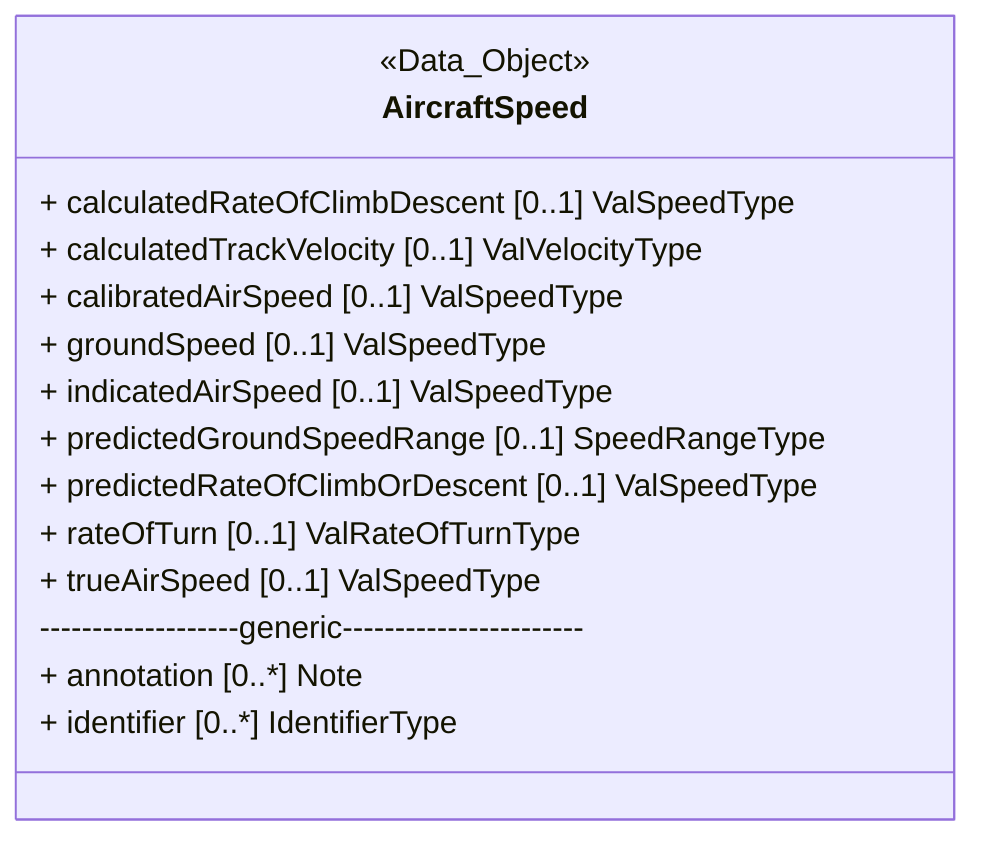
	
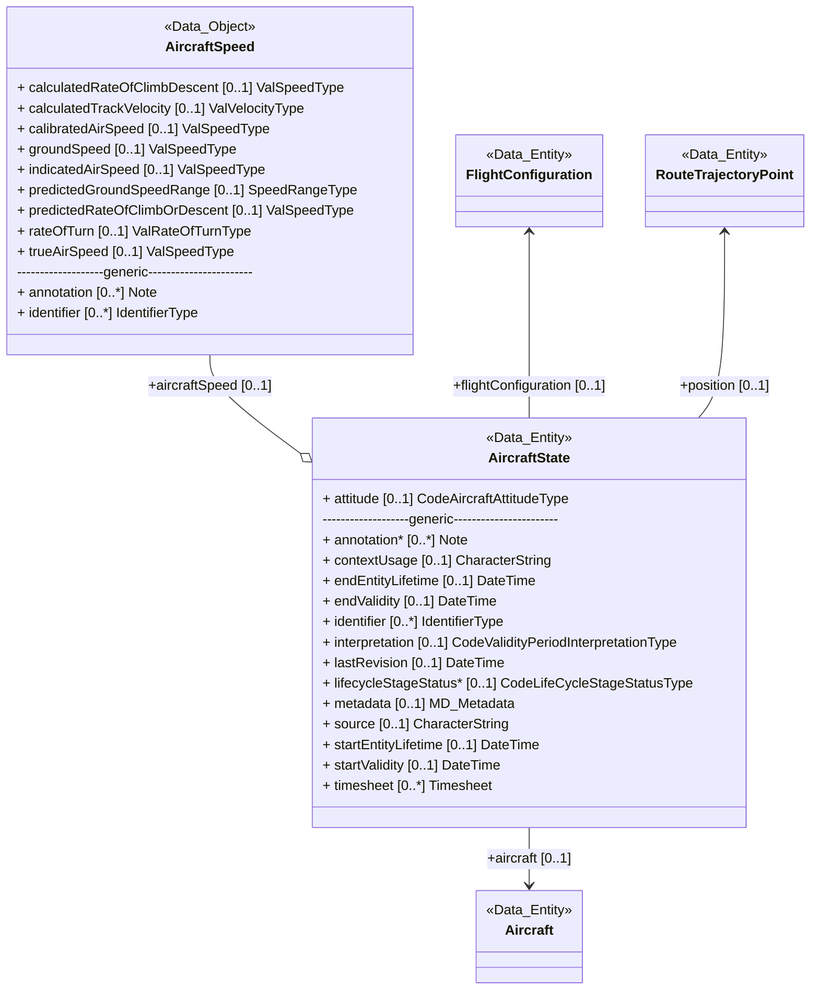
	
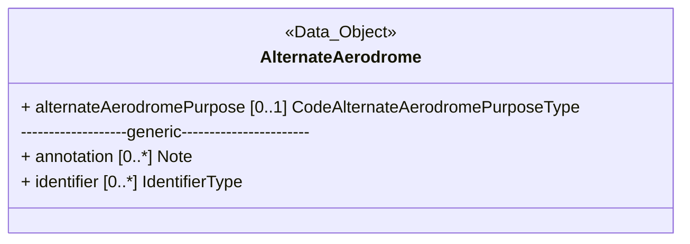
	
```mermaid	
classDiagram	
class Flight	
<<Data_Entity>> Flight	
link Flight "https://airm.aero/developers/advanced-search/1.0.0/Flight?model=LogicalModel" "Go to definition"	
class InfrastructurePoint	
<<Data_Entity>> InfrastructurePoint	
link InfrastructurePoint "https://airm.aero/developers/advanced-search/1.0.0/InfrastructurePoint?model=LogicalModel" "Go to definition"	
Flight --> InfrastructurePoint : +actualPassedWaypoint [0..*]	
class Aircraft	
<<Data_Entity>> Aircraft	
link Aircraft "https://airm.aero/developers/advanced-search/1.0.0/Aircraft?model=LogicalModel" "Go to definition"	
Aircraft <-- Flight : +aircraft [0..*]	
class AircraftIdentification	
<<Data_Object>> AircraftIdentification	
link AircraftIdentification "https://airm.aero/developers/advanced-search/1.0.0/AircraftIdentification?model=LogicalModel" "Go to definition"	
class Aircraft	
<<Data_Entity>> Aircraft	
link Aircraft "https://airm.aero/developers/advanced-search/1.0.0/Aircraft?model=LogicalModel" "Go to definition"	
AircraftIdentification --> Aircraft : +aircraft [0..1]	
class AircraftOperator	
<<Data_Entity>> AircraftOperator	
link AircraftOperator "https://airm.aero/developers/advanced-search/1.0.0/AircraftOperator?model=LogicalModel" "Go to definition"	
AircraftOperator <-- AircraftIdentification : +aircraftOperator [0..1]	
AircraftIdentification : + flightNumber [0..1] Number	
AircraftIdentification: -------------------generic-----------------------	
AircraftIdentification : + annotation [0..*] Note	
AircraftIdentification : + identifier [0..*] IdentifierType	
Flight o-- AircraftIdentification : +aircraftIdentification [0..1]	
class AirspaceEntry	
<<Data_Entity>> AirspaceEntry	
link AirspaceEntry "https://airm.aero/developers/advanced-search/1.0.0/AirspaceEntry?model=LogicalModel" "Go to definition"	
AirspaceEntry <-- Flight : +airspaceEntry [0..*]	
class AirspaceExit	
<<Data_Entity>> AirspaceExit	
link AirspaceExit "https://airm.aero/developers/advanced-search/1.0.0/AirspaceExit?model=LogicalModel" "Go to definition"	
Flight --> AirspaceExit : +airspaceExit [0..*]	
class Aerodrome	
<<Data_Entity>> Aerodrome	
link Aerodrome "https://airm.aero/developers/advanced-search/1.0.0/Aerodrome?model=LogicalModel" "Go to definition"	
Aerodrome <-- Flight : +alternateAerodrome [0..*]	
class ArrivalOperations	
<<Data_Entity>> ArrivalOperations	
link ArrivalOperations "https://airm.aero/developers/advanced-search/1.0.0/ArrivalOperations?model=LogicalModel" "Go to definition"	
ArrivalOperations <-- Flight : +arrivalOperations [0..*]	
class CoordinationAndTransfer	
<<Data_Entity>> CoordinationAndTransfer	
link CoordinationAndTransfer "https://airm.aero/developers/advanced-search/1.0.0/CoordinationAndTransfer?model=LogicalModel" "Go to definition"	
CoordinationAndTransfer <-- Flight : +coordination [0..*]	
class DangerousGoodsShipment	
<<Data_Entity>> DangerousGoodsShipment	
link DangerousGoodsShipment "https://airm.aero/developers/advanced-search/1.0.0/DangerousGoodsShipment?model=LogicalModel" "Go to definition"	
Flight --> DangerousGoodsShipment : +dangerousGoodsShipment [0..*]	
class Unit	
<<Data_Entity>> Unit	
link Unit "https://airm.aero/developers/advanced-search/1.0.0/Unit?model=LogicalModel" "Go to definition"	
Unit <-- Flight : +dataLinkAuthority [0..*]	
Flight : + dateOfDeparture [0..1] Date	
class Aerodrome	
<<Data_Entity>> Aerodrome	
link Aerodrome "https://airm.aero/developers/advanced-search/1.0.0/Aerodrome?model=LogicalModel" "Go to definition"	
Aerodrome <-- Flight : +departureAerodrome [0..1]	
class DepartureOperations	
<<Data_Entity>> DepartureOperations	
link DepartureOperations "https://airm.aero/developers/advanced-search/1.0.0/DepartureOperations?model=LogicalModel" "Go to definition"	
Flight --> DepartureOperations : +departureOperations [0..*]	
class Aerodrome	
<<Data_Entity>> Aerodrome	
link Aerodrome "https://airm.aero/developers/advanced-search/1.0.0/Aerodrome?model=LogicalModel" "Go to definition"	
Aerodrome <-- Flight : +destinationAerodrome [0..1]	
class DiplomaticClearance	
<<Data_Entity>> DiplomaticClearance	
link DiplomaticClearance "https://airm.aero/developers/advanced-search/1.0.0/DiplomaticClearance?model=LogicalModel" "Go to definition"	
Flight --> DiplomaticClearance : +diplomaticClearance [0..*]	
Flight : + diversionRecoveryFlight [0..*] Flight	
Flight : + emergencyContact [0..1] ContactInformation	
class EmergencyPhase	
<<Data_Entity>> EmergencyPhase	
link EmergencyPhase "https://airm.aero/developers/advanced-search/1.0.0/EmergencyPhase?model=LogicalModel" "Go to definition"	
EmergencyPhase <-- Flight : +emergencyPhase [0..*]	
class FlightCapability	
<<Data_Entity>> FlightCapability	
link FlightCapability "https://airm.aero/developers/advanced-search/1.0.0/FlightCapability?model=LogicalModel" "Go to definition"	
Flight --> FlightCapability : +flightCapability [0..1]	
Flight : + flightDataKind [0..1] CodeFlightDataKindType	
class FormationComponent	
<<Data_Object>> FormationComponent	
link FormationComponent "https://airm.aero/developers/advanced-search/1.0.0/FormationComponent?model=LogicalModel" "Go to definition"	
class AircraftType	
<<Data_Object>> AircraftType	
link AircraftType "https://airm.aero/developers/advanced-search/1.0.0/AircraftType?model=LogicalModel" "Go to definition"	
AircraftType : + classification [0..1] CodeAircraftClassificationType	
AircraftType : + iataIdentifier [0..1] CharacterString	
AircraftType : + icaoIdentifier [0..1] CharacterString	
AircraftType : + isCargo [0..1] Boolean	
AircraftType : + operationalName [0..1] CharacterString	
AircraftType: -------------------generic-----------------------	
AircraftType : + annotation [0..*] Note	
AircraftType : + identifier [0..*] IdentifierType	
FormationComponent o-- AircraftType : +aircraftType [0..1]	
class Aircraft	
<<Data_Entity>> Aircraft	
link Aircraft "https://airm.aero/developers/advanced-search/1.0.0/Aircraft?model=LogicalModel" "Go to definition"	
FormationComponent --> Aircraft : +fleetAircraft [0..*]	
FormationComponent : + numberOfAircraft [0..1] Integer	
class Unit	
<<Data_Entity>> Unit	
link Unit "https://airm.aero/developers/advanced-search/1.0.0/Unit?model=LogicalModel" "Go to definition"	
Unit <-- FormationComponent : +owner [0..*]	
FormationComponent: -------------------generic-----------------------	
FormationComponent : + annotation [0..*] Note	
FormationComponent : + identifier [0..*] IdentifierType	
Flight o-- FormationComponent : +formationComponent [0..*]	
Flight : + fuelEndurance [0..1] TM_Duration	
Flight : + globallyUniqueFlightIdentifier [0..1] CharacterString	
Flight : + hasSpecialRequirements [0..1] Boolean	
Flight : + ifplIdentifier [0..1] CharacterString	
Flight : + isAbleToAcceptAirToAirSeparation [0..1] Boolean	
Flight : + isAbleToAcceptCirclingApproaches [0..1] Boolean	
Flight : + isAbleToAcceptSpecificRunway [0..1] Boolean	
Flight : + isAirborne [0..1] Boolean	
Flight : + isFlightManagementForced [0..1] Boolean	
Flight : + isGroundDelayPreferrableOverReRoute [0..1] Boolean	
Flight : + isIFPLIdentifierTemporary [0..1] Boolean	
Flight : + isReRouteOf120NmAcceptable [0..1] Boolean	
class MilitaryAuthority	
<<Data_Entity>> MilitaryAuthority	
link MilitaryAuthority "https://airm.aero/developers/advanced-search/1.0.0/MilitaryAuthority?model=LogicalModel" "Go to definition"	
Flight --> MilitaryAuthority : +militaryAircraftOperator [0..*]	
Flight : + nextFlight [0..1] Flight	
Flight : + numberOfAircraft [0..1] Integer	
class AircraftOperator	
<<Data_Entity>> AircraftOperator	
link AircraftOperator "https://airm.aero/developers/advanced-search/1.0.0/AircraftOperator?model=LogicalModel" "Go to definition"	
AircraftOperator <-- Flight : +operator [0..*]	
Flight : + operatorFlightPriority [0..1] Integer	
Flight : + origin [0..1] CodeFlightOriginType	
class PilotInCommand	
<<Data_Entity>> PilotInCommand	
link PilotInCommand "https://airm.aero/developers/advanced-search/1.0.0/PilotInCommand?model=LogicalModel" "Go to definition"	
Flight --> PilotInCommand : +pilot [0..1]	
Flight : + preferredCourseDeviationIfReRoute [0..1] CodeCompassPointType	
Flight : + previousFlight [0..1] Flight	
Flight : + readyStatus [0..1] CodeFlightReadyStatusType	
Flight : + reasonForSpecialHandling [0..1] CodeReasonForSpecialHandlingType	
class Unit	
<<Data_Entity>> Unit	
link Unit "https://airm.aero/developers/advanced-search/1.0.0/Unit?model=LogicalModel" "Go to definition"	
Unit <-- Flight : +responsibleATSU [0..1]	
class RouteTrajectory	
<<Data_Entity>> RouteTrajectory	
link RouteTrajectory "https://airm.aero/developers/advanced-search/1.0.0/RouteTrajectory?model=LogicalModel" "Go to definition"	
Flight --> RouteTrajectory : +routeTrajectory [0..*]	
class SSRCode	
<<Data_Entity>> SSRCode	
link SSRCode "https://airm.aero/developers/advanced-search/1.0.0/SSRCode?model=LogicalModel" "Go to definition"	
Flight --> SSRCode : +ssrCode [0..*]	
Flight : + statusFFICE [0..1] CodeFFICEStatusType	
Flight : + statusForCount [1] CodeFlightStatusForCountType	
Flight : + totalEstimatedElapsedTime [0..1] TM_Duration	
Flight : + type [0..1] CodeFlightType	
Flight: -------------------generic-----------------------	
Flight : + annotation* [0..*] Note	
Flight : + contextUsage [0..1] CharacterString	
Flight : + endEntityLifetime [0..1] DateTime	
Flight : + endValidity [0..1] DateTime	
Flight : + identifier [0..*] IdentifierType	
Flight : + interpretation [0..1] CodeValidityPeriodInterpretationType	
Flight : + lastRevision [0..1] DateTime	
Flight : + lifecycleStageStatus* [0..1] CodeLifeCycleStageStatusType	
Flight : + metadata [0..1] MD_Metadata	
Flight : + source [0..1] CharacterString	
Flight : + startEntityLifetime [0..1] DateTime	
Flight : + startValidity [0..1] DateTime	
Flight : + timesheet [0..*] Timesheet	
```	
	
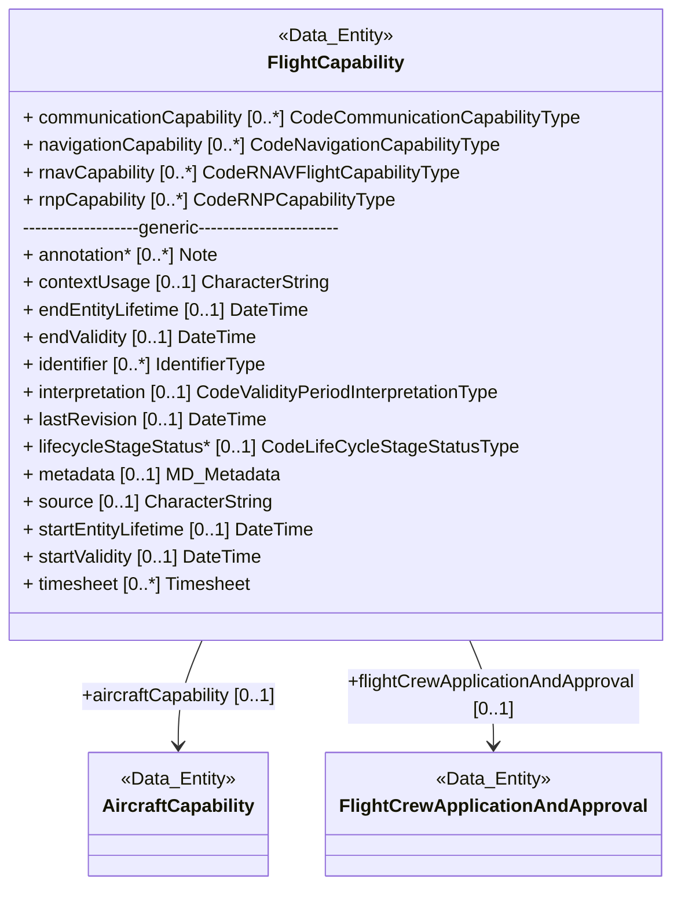
	
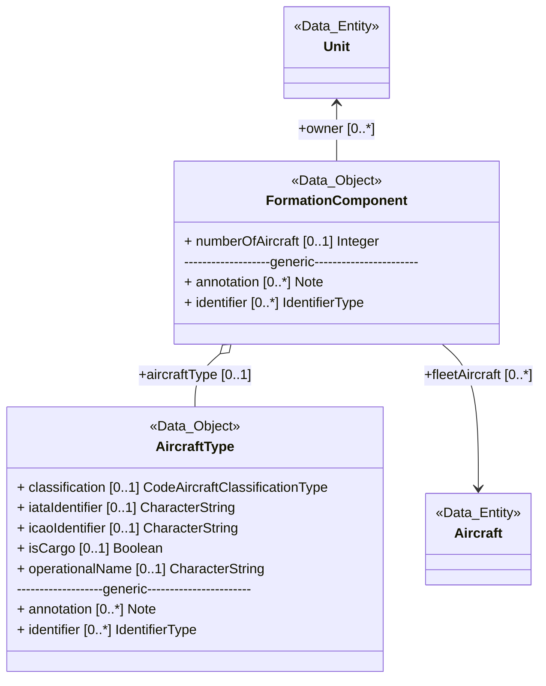
	
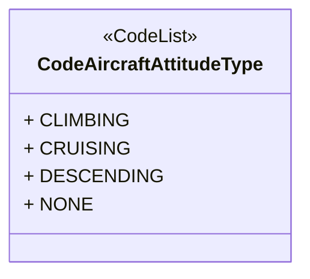
	
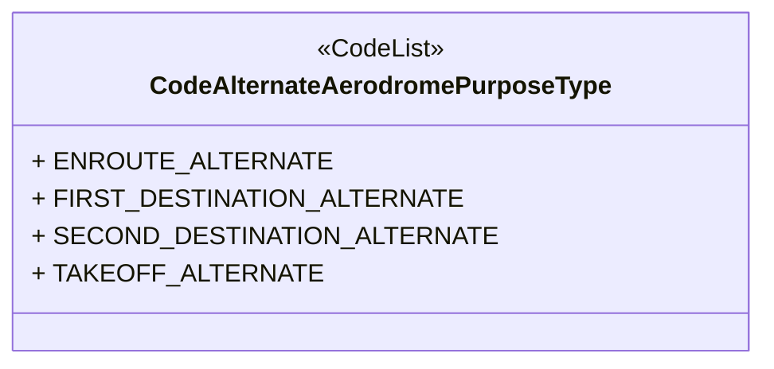
	
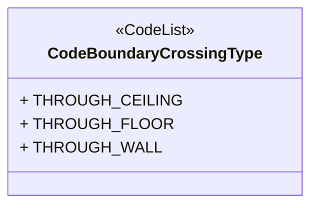
	
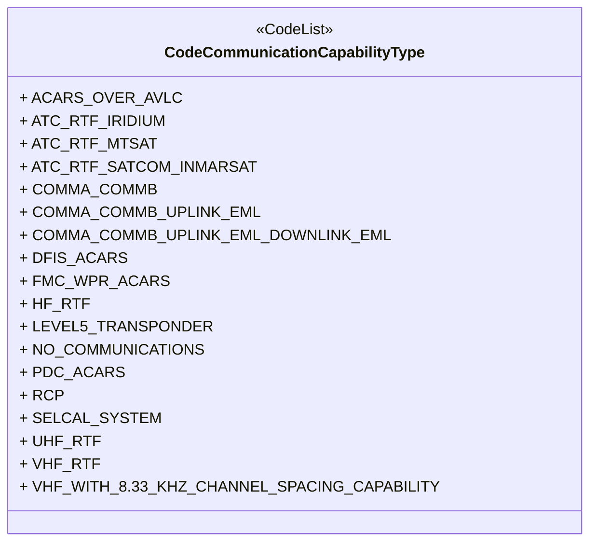
	
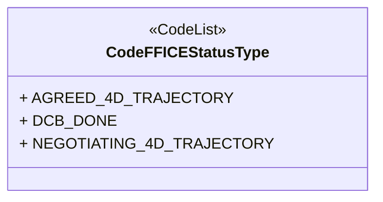
	
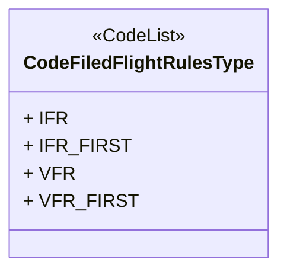
	
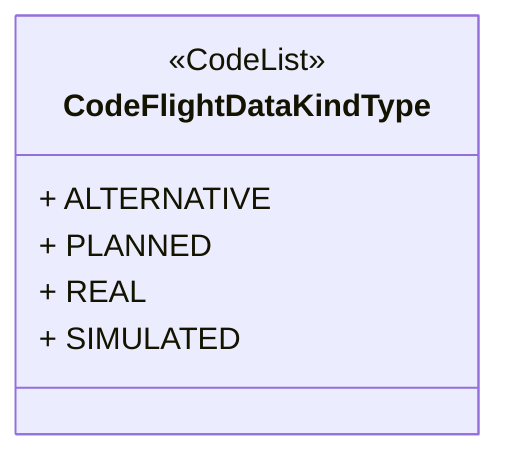
	
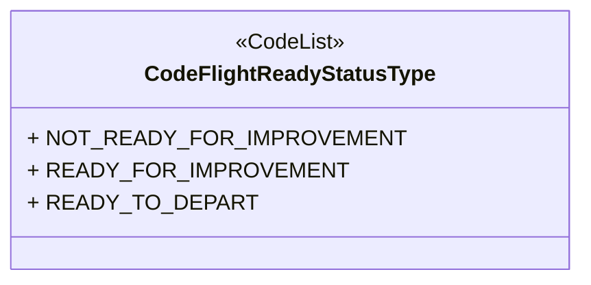
	
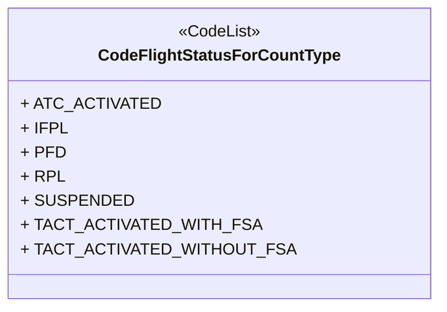
	
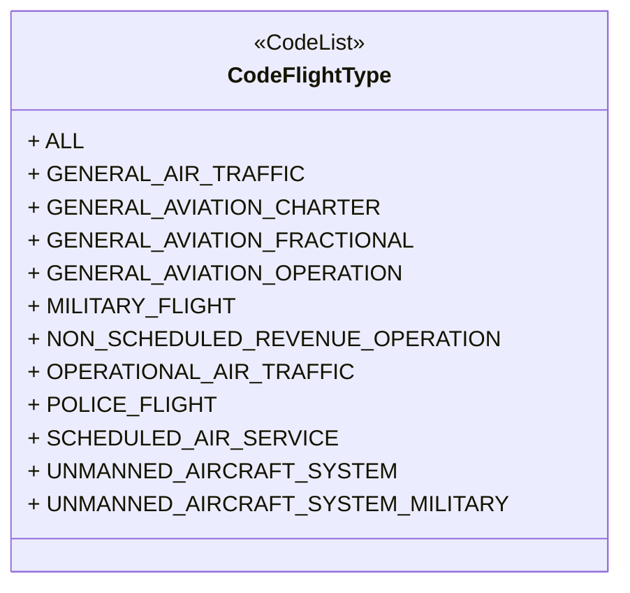
	
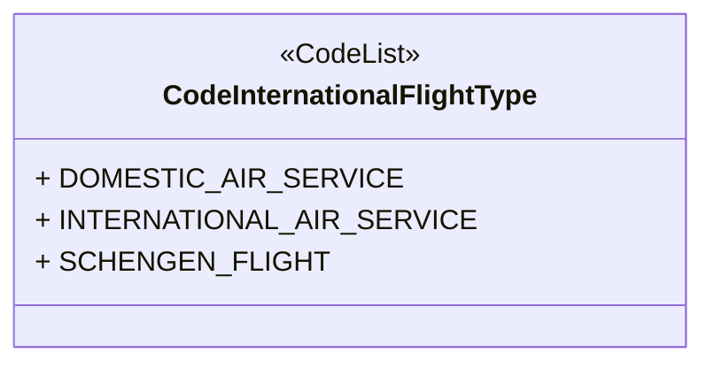
	
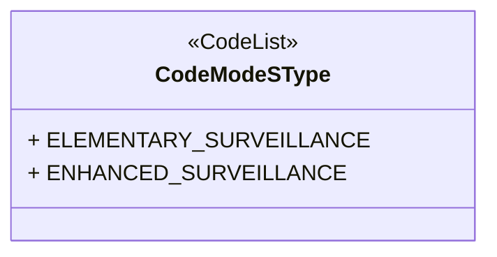
	
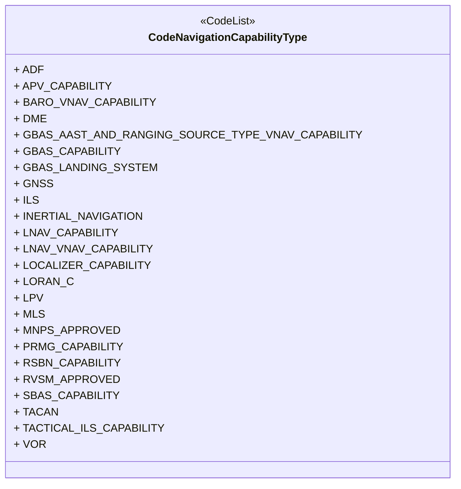
	
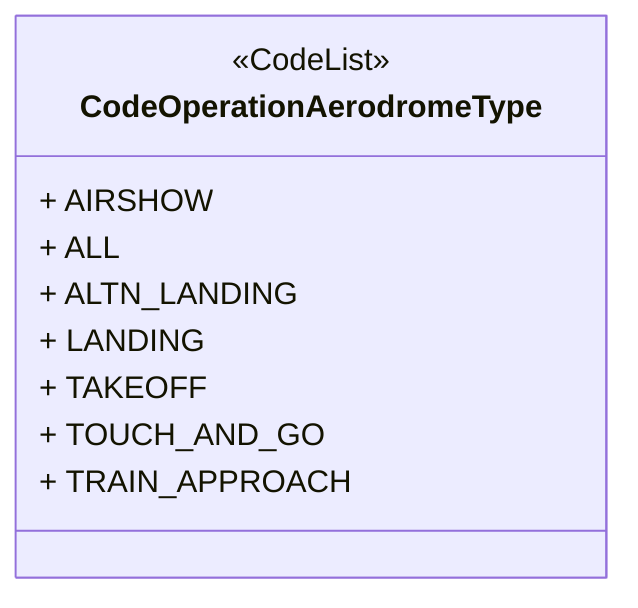
	
```mermaid	
classDiagram	
class CodeOperationManoeuvringAreaType	
<<CodeList>> CodeOperationManoeuvringAreaType	
link CodeOperationManoeuvringAreaType "https://airm.aero/developers/advanced-search/1.0.0/CodeOperationManoeuvringAreaType?model=LogicalModel" "Go to definition"	
CodeOperationManoeuvringAreaType : + AIRSHOW	
CodeOperationManoeuvringAreaType : + ALL	
CodeOperationManoeuvringAreaType : + CROSSING	
CodeOperationManoeuvringAreaType : + LANDING	
CodeOperationManoeuvringAreaType : + TAKEOFF	
CodeOperationManoeuvringAreaType : + TAXIING	
CodeOperationManoeuvringAreaType : + TOUCH_AND_GO	
CodeOperationManoeuvringAreaType : + TRAIN_APPROACH	
```	
	
```mermaid	
classDiagram	
class CodeReasonForSpecialHandlingType	
<<CodeList>> CodeReasonForSpecialHandlingType	
link CodeReasonForSpecialHandlingType "https://airm.aero/developers/advanced-search/1.0.0/CodeReasonForSpecialHandlingType?model=LogicalModel" "Go to definition"	
CodeReasonForSpecialHandlingType : + ALL	
CodeReasonForSpecialHandlingType : + ALTRV	
CodeReasonForSpecialHandlingType : + ATFMX	
CodeReasonForSpecialHandlingType : + CPDLCX	
CodeReasonForSpecialHandlingType : + DEFENCE	
CodeReasonForSpecialHandlingType : + EMERGENCY	
CodeReasonForSpecialHandlingType : + EXM833	
CodeReasonForSpecialHandlingType : + FFR	
CodeReasonForSpecialHandlingType : + FLIGHT_ASSISTANCE	
CodeReasonForSpecialHandlingType : + FLTCK	
CodeReasonForSpecialHandlingType : + HAZMAT	
CodeReasonForSpecialHandlingType : + HEAD	
CodeReasonForSpecialHandlingType : + HOSP	
CodeReasonForSpecialHandlingType : + HUM	
CodeReasonForSpecialHandlingType : + MARSA	
CodeReasonForSpecialHandlingType : + MEDEVAC	
CodeReasonForSpecialHandlingType : + NON_RVSM	
CodeReasonForSpecialHandlingType : + POLICE	
CodeReasonForSpecialHandlingType : + PROTECTED	
CodeReasonForSpecialHandlingType : + RESTRICTED	
CodeReasonForSpecialHandlingType : + RNAVINOP	
CodeReasonForSpecialHandlingType : + RNAVX	
CodeReasonForSpecialHandlingType : + SAR	
CodeReasonForSpecialHandlingType : + STATE	
CodeReasonForSpecialHandlingType : + STATE_OFFICIALS	
```	
	
```mermaid	
classDiagram	
class CodeRNAVFlightCapabilityType	
<<CodeList>> CodeRNAVFlightCapabilityType	
link CodeRNAVFlightCapabilityType "https://airm.aero/developers/advanced-search/1.0.0/CodeRNAVFlightCapabilityType?model=LogicalModel" "Go to definition"	
CodeRNAVFlightCapabilityType : + RNAV_1_ALL_PERMITTED_SENSORS	
CodeRNAVFlightCapabilityType : + RNAV_1_DME_DME	
CodeRNAVFlightCapabilityType : + RNAV_1_DME_DME_IRU	
CodeRNAVFlightCapabilityType : + RNAV_1_GNSS	
CodeRNAVFlightCapabilityType : + RNAV_10	
CodeRNAVFlightCapabilityType : + RNAV_2_ALL_PERMITTED_SENSORS	
CodeRNAVFlightCapabilityType : + RNAV_2_DME_DME	
CodeRNAVFlightCapabilityType : + RNAV_2_DME_DME_IRU	
CodeRNAVFlightCapabilityType : + RNAV_2_GNSS	
CodeRNAVFlightCapabilityType : + RNAV_5_ALL_PERMITTED_SENSORS	
CodeRNAVFlightCapabilityType : + RNAV_5_DME_DME	
CodeRNAVFlightCapabilityType : + RNAV_5_GNSS	
CodeRNAVFlightCapabilityType : + RNAV_5_INS_OR_IRS	
CodeRNAVFlightCapabilityType : + RNAV_5_LORANC	
CodeRNAVFlightCapabilityType : + RNAV_5_VOR_DME	
```	
	
```mermaid	
classDiagram	
class CodeRNPCapabilityType	
<<CodeList>> CodeRNPCapabilityType	
link CodeRNPCapabilityType "https://airm.aero/developers/advanced-search/1.0.0/CodeRNPCapabilityType?model=LogicalModel" "Go to definition"	
CodeRNPCapabilityType : + BASIC_RNP_1_ALL_PERMITTED_SENSORS	
CodeRNPCapabilityType : + BASIC_RNP_1_DME_DME	
CodeRNPCapabilityType : + BASIC_RNP_1_DME_DME_IRU	
CodeRNPCapabilityType : + BASIC_RNP_1_GNSS	
CodeRNPCapabilityType : + RNP_4	
CodeRNPCapabilityType : + RNP_APCH	
CodeRNPCapabilityType : + RNP_APCH_WITH_BARO_VNAV	
CodeRNPCapabilityType : + RNP_AR_APCH_WITH_RF	
CodeRNPCapabilityType : + RNP_AR_APCH_WITHOUT_RF	
```	
	
```mermaid	
classDiagram	
class CodeRouteTrajectoryPointUsageType	
<<CodeList>> CodeRouteTrajectoryPointUsageType	
link CodeRouteTrajectoryPointUsageType "https://airm.aero/developers/advanced-search/1.0.0/CodeRouteTrajectoryPointUsageType?model=LogicalModel" "Go to definition"	
CodeRouteTrajectoryPointUsageType : + ADEP	
CodeRouteTrajectoryPointUsageType : + ADES	
CodeRouteTrajectoryPointUsageType : + BEACON	
CodeRouteTrajectoryPointUsageType : + BEGIN_STAY_POINT	
CodeRouteTrajectoryPointUsageType : + BOTTOM_OF_CLIMB	
CodeRouteTrajectoryPointUsageType : + BOTTOM_OF_DESCENT	
CodeRouteTrajectoryPointUsageType : + BOUNDARY_POINT	
CodeRouteTrajectoryPointUsageType : + CONSTRAINT_POINT	
CodeRouteTrajectoryPointUsageType : + CROSSING_INTO_CONSTRAINED_AIRSPACE_POINT	
CodeRouteTrajectoryPointUsageType : + CROSSOVER_ALTITUDE_POINT	
CodeRouteTrajectoryPointUsageType : + END_OF_LANDING_ROLL_POINT	
CodeRouteTrajectoryPointUsageType : + END_OF_TURN	
CodeRouteTrajectoryPointUsageType : + END_PREDICTION_POINT	
CodeRouteTrajectoryPointUsageType : + END_STAY_POINT	
CodeRouteTrajectoryPointUsageType : + EXIT_FROM_CONSTRAINED_AIRSPACE_POINT	
CodeRouteTrajectoryPointUsageType : + FIR_BOUNDARY_CROSSING_POINT	
CodeRouteTrajectoryPointUsageType : + FROM_GAT_TO_OAT_POINT	
CodeRouteTrajectoryPointUsageType : + FROM_IFR_TO_VFR_POINT	
CodeRouteTrajectoryPointUsageType : + FROM_OAT_TO_GAT_POINT	
CodeRouteTrajectoryPointUsageType : + FROM_VFR_TO_IFR_POINT	
CodeRouteTrajectoryPointUsageType : + HOLD_ENTRY_POINT	
CodeRouteTrajectoryPointUsageType : + HOLD_EXIT_POINT	
CodeRouteTrajectoryPointUsageType : + INITIAL_PREDICTION_POINT	
CodeRouteTrajectoryPointUsageType : + INTERMEDIATE_POINT	
CodeRouteTrajectoryPointUsageType : + MIDDLE_OF_TURN	
CodeRouteTrajectoryPointUsageType : + STAR_ENTRY	
CodeRouteTrajectoryPointUsageType : + START_OF_TAKEOFF_ROLL	
CodeRouteTrajectoryPointUsageType : + START_OF_TURN	
CodeRouteTrajectoryPointUsageType : + TOP_OF_CLIMB	
CodeRouteTrajectoryPointUsageType : + TOP_OF_DESCENT	
CodeRouteTrajectoryPointUsageType : + TRAJECTORY_CHANGE_POINT	
CodeRouteTrajectoryPointUsageType : + TRANSITION_ALTITUDE_OR_LEVEL_POINT	
CodeRouteTrajectoryPointUsageType : + UNPUBLISHED_ROUTE_POINT	
CodeRouteTrajectoryPointUsageType : + WHEELS_OFF_POINT	
CodeRouteTrajectoryPointUsageType : + WHEELS_ON_POINT	
```	
	
```mermaid	
classDiagram	
class CodeRouteTrajectorySegmentType	
<<CodeList>> CodeRouteTrajectorySegmentType	
link CodeRouteTrajectorySegmentType "https://airm.aero/developers/advanced-search/1.0.0/CodeRouteTrajectorySegmentType?model=LogicalModel" "Go to definition"	
CodeRouteTrajectorySegmentType : + AIRBORNE_SEGMENT	
CodeRouteTrajectorySegmentType : + AIRBORNE_SEGMENT_ELEMENT	
CodeRouteTrajectorySegmentType : + ARRIVAL_SURFACE_SEGMENT	
CodeRouteTrajectorySegmentType : + ARRIVAL_SURFACE_SEGMENT_ELEMENT	
CodeRouteTrajectorySegmentType : + DEPARTURE_SURFACE_SEGMENT	
CodeRouteTrajectorySegmentType : + DEPARTURE_SURFACE_SEGMENT_ELEMENT	
CodeRouteTrajectorySegmentType : + DIRECT_FLIGHT_SEGMENT	
CodeRouteTrajectorySegmentType : + TAXI_PATH	
CodeRouteTrajectorySegmentType : + TAXI_PATH_ELEMENT	
```	
	
```mermaid	
classDiagram	
class CodeRouteTrajectoryType	
<<CodeList>> CodeRouteTrajectoryType	
link CodeRouteTrajectoryType "https://airm.aero/developers/advanced-search/1.0.0/CodeRouteTrajectoryType?model=LogicalModel" "Go to definition"	
CodeRouteTrajectoryType : + AIRCRAFT_INTENT	
CodeRouteTrajectoryType : + DESIRED_4D_TRAJECTORY	
CodeRouteTrajectoryType : + EXECUTED_4D_TRAJECTORY	
CodeRouteTrajectoryType : + EXPANDED_ROUTE	
CodeRouteTrajectoryType : + FLIGHT_ROUTE	
CodeRouteTrajectoryType : + NOMINAL_PREFERRED_ROUTE	
CodeRouteTrajectoryType : + USER_PREFERRED_TRAJECTORY	
```	
	
```mermaid	
classDiagram	
class CodeSpeedReferenceType	
<<CodeList>> CodeSpeedReferenceType	
link CodeSpeedReferenceType "https://airm.aero/developers/advanced-search/1.0.0/CodeSpeedReferenceType?model=LogicalModel" "Go to definition"	
CodeSpeedReferenceType : + GROUND_SPEED	
CodeSpeedReferenceType : + INDICATED_AIRSPEED	
CodeSpeedReferenceType : + TRUE_AIRSPEED	
```	
	
```mermaid	
classDiagram	
class CodeSSRCategoryType	
<<CodeList>> CodeSSRCategoryType	
link CodeSSRCategoryType "https://airm.aero/developers/advanced-search/1.0.0/CodeSSRCategoryType?model=LogicalModel" "Go to definition"	
CodeSSRCategoryType : + CONSPICUITY_SSR_CODE_FOR_MODE_S	
CodeSSRCategoryType : + SSR_CODE_FOR_LOCAL_FLIGHT	
CodeSSRCategoryType : + SSR_CODE_FOR_MILITARY_FLIGHT	
CodeSSRCategoryType : + SSR_CODE_FOR_SPECIAL_PURPOSE	
CodeSSRCategoryType : + SSR_CODE_FOR_TRANSIT_FLIGHT	
CodeSSRCategoryType : + SSR_CODE_FOR_VFR_FLIGHT	
```	
	
```mermaid	
classDiagram	
class CodeSSRCodeStatusType	
<<CodeList>> CodeSSRCodeStatusType	
link CodeSSRCodeStatusType "https://airm.aero/developers/advanced-search/1.0.0/CodeSSRCodeStatusType?model=LogicalModel" "Go to definition"	
CodeSSRCodeStatusType : + ASSIGNED	
CodeSSRCodeStatusType : + NEXT	
CodeSSRCodeStatusType : + PREVIOUS	
```	
	
```mermaid	
classDiagram	
class CodeSSRModeType	
<<CodeList>> CodeSSRModeType	
link CodeSSRModeType "https://airm.aero/developers/advanced-search/1.0.0/CodeSSRModeType?model=LogicalModel" "Go to definition"	
CodeSSRModeType : + MODE_1	
CodeSSRModeType : + MODE_2	
CodeSSRModeType : + MODE_3A	
CodeSSRModeType : + MODE_A_C	
CodeSSRModeType : + MODE_S	
```	
	
```mermaid	
classDiagram	
class CodeTargetTimeStatusType	
<<CodeList>> CodeTargetTimeStatusType	
link CodeTargetTimeStatusType "https://airm.aero/developers/advanced-search/1.0.0/CodeTargetTimeStatusType?model=LogicalModel" "Go to definition"	
CodeTargetTimeStatusType : + CANCELLED	
CodeTargetTimeStatusType : + NEW	
CodeTargetTimeStatusType : + UPDATED	
```	
	
```mermaid	
classDiagram	
class CodeTrajectoryDialogueStatusType	
<<CodeList>> CodeTrajectoryDialogueStatusType	
link CodeTrajectoryDialogueStatusType "https://airm.aero/developers/advanced-search/1.0.0/CodeTrajectoryDialogueStatusType?model=LogicalModel" "Go to definition"	
CodeTrajectoryDialogueStatusType : + ACCEPTED	
CodeTrajectoryDialogueStatusType : + FILED	
CodeTrajectoryDialogueStatusType : + REJECTED	
CodeTrajectoryDialogueStatusType : + REQUESTED	
```	
	
```mermaid	
classDiagram	
class CodeTrajectoryPointAcceptanceStatusType	
<<CodeList>> CodeTrajectoryPointAcceptanceStatusType	
link CodeTrajectoryPointAcceptanceStatusType "https://airm.aero/developers/advanced-search/1.0.0/CodeTrajectoryPointAcceptanceStatusType?model=LogicalModel" "Go to definition"	
CodeTrajectoryPointAcceptanceStatusType : + ACCEPTED	
CodeTrajectoryPointAcceptanceStatusType : + REJECTED	
```	
	
```mermaid	
classDiagram	
class AirspaceEntry	
<<Data_Entity>> AirspaceEntry	
link AirspaceEntry "https://airm.aero/developers/advanced-search/1.0.0/AirspaceEntry?model=LogicalModel" "Go to definition"	
AirspaceEntry : + boundaryCrossingType [0..1] CodeBoundaryCrossingType	
AirspaceEntry : + distanceFlownAtEntry [0..1] ValDistanceType	
class Airspace	
<<Data_Entity>> Airspace	
link Airspace "https://airm.aero/developers/advanced-search/1.0.0/Airspace?model=LogicalModel" "Go to definition"	
AirspaceEntry --> Airspace : +enteredAirspace [0..1]	
class RouteTrajectoryPoint	
<<Data_Entity>> RouteTrajectoryPoint	
link RouteTrajectoryPoint "https://airm.aero/developers/advanced-search/1.0.0/RouteTrajectoryPoint?model=LogicalModel" "Go to definition"	
RouteTrajectoryPoint <-- AirspaceEntry : +entryPoint [0..1]	
class Flight	
<<Data_Entity>> Flight	
link Flight "https://airm.aero/developers/advanced-search/1.0.0/Flight?model=LogicalModel" "Go to definition"	
AirspaceEntry --> Flight : +flight [0..*]	
AirspaceEntry : + time [0..1] DateTimeWithPlanningType	
AirspaceEntry: -------------------generic-----------------------	
AirspaceEntry : + annotation* [0..*] Note	
AirspaceEntry : + contextUsage [0..1] CharacterString	
AirspaceEntry : + endEntityLifetime [0..1] DateTime	
AirspaceEntry : + endValidity [0..1] DateTime	
AirspaceEntry : + identifier [0..*] IdentifierType	
AirspaceEntry : + interpretation [0..1] CodeValidityPeriodInterpretationType	
AirspaceEntry : + lastRevision [0..1] DateTime	
AirspaceEntry : + lifecycleStageStatus* [0..1] CodeLifeCycleStageStatusType	
AirspaceEntry : + metadata [0..1] MD_Metadata	
AirspaceEntry : + source [0..1] CharacterString	
AirspaceEntry : + startEntityLifetime [0..1] DateTime	
AirspaceEntry : + startValidity [0..1] DateTime	
AirspaceEntry : + timesheet [0..*] Timesheet	
```	
	
```mermaid	
classDiagram	
class AirspaceExit	
<<Data_Entity>> AirspaceExit	
link AirspaceExit "https://airm.aero/developers/advanced-search/1.0.0/AirspaceExit?model=LogicalModel" "Go to definition"	
AirspaceExit : + distanceFlownAtExit [0..1] ValDistanceType	
class Airspace	
<<Data_Entity>> Airspace	
link Airspace "https://airm.aero/developers/advanced-search/1.0.0/Airspace?model=LogicalModel" "Go to definition"	
Airspace <-- AirspaceExit : +exitedAirspace [0..1]	
class RouteTrajectoryPoint	
<<Data_Entity>> RouteTrajectoryPoint	
link RouteTrajectoryPoint "https://airm.aero/developers/advanced-search/1.0.0/RouteTrajectoryPoint?model=LogicalModel" "Go to definition"	
AirspaceExit --> RouteTrajectoryPoint : +exitPoint [0..1]	
AirspaceExit : + time [0..1] DateTimeWithPlanningType	
AirspaceExit: -------------------generic-----------------------	
AirspaceExit : + annotation* [0..*] Note	
AirspaceExit : + contextUsage [0..1] CharacterString	
AirspaceExit : + endEntityLifetime [0..1] DateTime	
AirspaceExit : + endValidity [0..1] DateTime	
AirspaceExit : + identifier [0..*] IdentifierType	
AirspaceExit : + interpretation [0..1] CodeValidityPeriodInterpretationType	
AirspaceExit : + lastRevision [0..1] DateTime	
AirspaceExit : + lifecycleStageStatus* [0..1] CodeLifeCycleStageStatusType	
AirspaceExit : + metadata [0..1] MD_Metadata	
AirspaceExit : + source [0..1] CharacterString	
AirspaceExit : + startEntityLifetime [0..1] DateTime	
AirspaceExit : + startValidity [0..1] DateTime	
AirspaceExit : + timesheet [0..*] Timesheet	
```	
	
```mermaid	
classDiagram	
class AtNode	
<<Data_Entity>> AtNode	
link AtNode "https://airm.aero/developers/advanced-search/1.0.0/AtNode?model=LogicalModel" "Go to definition"	
class AerodromeSurfaceRoutingNetworkNode	
<<Data_Entity>> AerodromeSurfaceRoutingNetworkNode	
link AerodromeSurfaceRoutingNetworkNode "https://airm.aero/developers/advanced-search/1.0.0/AerodromeSurfaceRoutingNetworkNode?model=LogicalModel" "Go to definition"	
AerodromeSurfaceRoutingNetworkNode <-- AtNode : +node [0..1]	
AtNode : + speed [0..1] ValSpeedType	
AtNode : + time [0..1] DateTimeWithPlanningType	
AtNode: -------------------generic-----------------------	
AtNode : + annotation* [0..*] Note	
AtNode : + contextUsage [0..1] CharacterString	
AtNode : + endEntityLifetime [0..1] DateTime	
AtNode : + endValidity [0..1] DateTime	
AtNode : + identifier [0..*] IdentifierType	
AtNode : + interpretation [0..1] CodeValidityPeriodInterpretationType	
AtNode : + lastRevision [0..1] DateTime	
AtNode : + lifecycleStageStatus* [0..1] CodeLifeCycleStageStatusType	
AtNode : + metadata [0..1] MD_Metadata	
AtNode : + source [0..1] CharacterString	
AtNode : + startEntityLifetime [0..1] DateTime	
AtNode : + startValidity [0..1] DateTime	
AtNode : + timesheet [0..*] Timesheet	
```	
	
```mermaid	
classDiagram	
class InBlock	
<<Data_Entity>> InBlock	
link InBlock "https://airm.aero/developers/advanced-search/1.0.0/InBlock?model=LogicalModel" "Go to definition"	
class ArrivalOperations	
<<Data_Entity>> ArrivalOperations	
link ArrivalOperations "https://airm.aero/developers/advanced-search/1.0.0/ArrivalOperations?model=LogicalModel" "Go to definition"	
ArrivalOperations <-- InBlock : +arrival [0..*]	
InBlock : + time [0..*] DateTimeWithPlanningType	
InBlock: -------------------generic-----------------------	
InBlock : + annotation* [0..*] Note	
InBlock : + contextUsage [0..1] CharacterString	
InBlock : + endEntityLifetime [0..1] DateTime	
InBlock : + endValidity [0..1] DateTime	
InBlock : + identifier [0..*] IdentifierType	
InBlock : + interpretation [0..1] CodeValidityPeriodInterpretationType	
InBlock : + lastRevision [0..1] DateTime	
InBlock : + lifecycleStageStatus* [0..1] CodeLifeCycleStageStatusType	
InBlock : + metadata [0..1] MD_Metadata	
InBlock : + source [0..1] CharacterString	
InBlock : + startEntityLifetime [0..1] DateTime	
InBlock : + startValidity [0..1] DateTime	
InBlock : + timesheet [0..*] Timesheet	
```	
	
```mermaid	
classDiagram	
class Landing	
<<Data_Entity>> Landing	
link Landing "https://airm.aero/developers/advanced-search/1.0.0/Landing?model=LogicalModel" "Go to definition"	
class ArrivalOperations	
<<Data_Entity>> ArrivalOperations	
link ArrivalOperations "https://airm.aero/developers/advanced-search/1.0.0/ArrivalOperations?model=LogicalModel" "Go to definition"	
ArrivalOperations <-- Landing : +arrival [0..*]	
Landing : + landingTolerance [0..1] DateTime	
class RunwayDirection	
<<Data_Entity>> RunwayDirection	
link RunwayDirection "https://airm.aero/developers/advanced-search/1.0.0/RunwayDirection?model=LogicalModel" "Go to definition"	
RunwayDirection <-- Landing : +preferredLandingRunwayDirection [0..1]	
Landing : + time [0..*] DateTimeWithPlanningType	
Landing: -------------------generic-----------------------	
Landing : + annotation* [0..*] Note	
Landing : + contextUsage [0..1] CharacterString	
Landing : + endEntityLifetime [0..1] DateTime	
Landing : + endValidity [0..1] DateTime	
Landing : + identifier [0..*] IdentifierType	
Landing : + interpretation [0..1] CodeValidityPeriodInterpretationType	
Landing : + lastRevision [0..1] DateTime	
Landing : + lifecycleStageStatus* [0..1] CodeLifeCycleStageStatusType	
Landing : + metadata [0..1] MD_Metadata	
Landing : + source [0..1] CharacterString	
Landing : + startEntityLifetime [0..1] DateTime	
Landing : + startValidity [0..1] DateTime	
Landing : + timesheet [0..*] Timesheet	
```	
	
```mermaid	
classDiagram	
class OffBlock	
<<Data_Entity>> OffBlock	
link OffBlock "https://airm.aero/developers/advanced-search/1.0.0/OffBlock?model=LogicalModel" "Go to definition"	
class DepartureOperations	
<<Data_Entity>> DepartureOperations	
link DepartureOperations "https://airm.aero/developers/advanced-search/1.0.0/DepartureOperations?model=LogicalModel" "Go to definition"	
OffBlock --> DepartureOperations : +departure [0..*]	
OffBlock : + time [0..*] DateTimeWithPlanningType	
OffBlock: -------------------generic-----------------------	
OffBlock : + annotation* [0..*] Note	
OffBlock : + contextUsage [0..1] CharacterString	
OffBlock : + endEntityLifetime [0..1] DateTime	
OffBlock : + endValidity [0..1] DateTime	
OffBlock : + identifier [0..*] IdentifierType	
OffBlock : + interpretation [0..1] CodeValidityPeriodInterpretationType	
OffBlock : + lastRevision [0..1] DateTime	
OffBlock : + lifecycleStageStatus* [0..1] CodeLifeCycleStageStatusType	
OffBlock : + metadata [0..1] MD_Metadata	
OffBlock : + source [0..1] CharacterString	
OffBlock : + startEntityLifetime [0..1] DateTime	
OffBlock : + startValidity [0..1] DateTime	
OffBlock : + timesheet [0..*] Timesheet	
```	
	
```mermaid	
classDiagram	
class OffBlockReady	
<<Data_Entity>> OffBlockReady	
link OffBlockReady "https://airm.aero/developers/advanced-search/1.0.0/OffBlockReady?model=LogicalModel" "Go to definition"	
OffBlockReady : + time [0..*] DateTimeWithPlanningType	
OffBlockReady : + tobtUpdateCount [0..1] Integer	
OffBlockReady: -------------------generic-----------------------	
OffBlockReady : + annotation* [0..*] Note	
OffBlockReady : + contextUsage [0..1] CharacterString	
OffBlockReady : + endEntityLifetime [0..1] DateTime	
OffBlockReady : + endValidity [0..1] DateTime	
OffBlockReady : + identifier [0..*] IdentifierType	
OffBlockReady : + interpretation [0..1] CodeValidityPeriodInterpretationType	
OffBlockReady : + lastRevision [0..1] DateTime	
OffBlockReady : + lifecycleStageStatus* [0..1] CodeLifeCycleStageStatusType	
OffBlockReady : + metadata [0..1] MD_Metadata	
OffBlockReady : + source [0..1] CharacterString	
OffBlockReady : + startEntityLifetime [0..1] DateTime	
OffBlockReady : + startValidity [0..1] DateTime	
OffBlockReady : + timesheet [0..*] Timesheet	
```	
	
```mermaid	
classDiagram	
class OverPoint	
<<Data_Entity>> OverPoint	
link OverPoint "https://airm.aero/developers/advanced-search/1.0.0/OverPoint?model=LogicalModel" "Go to definition"	
OverPoint : + assignedFlightLevel [0..1] ValAltitudeWithBoundaryType	
OverPoint : + assignedSpeed [0..1] ValSpeedWithBoundaryType	
OverPoint : + delay [0..1] DurationWithPlanningType	
OverPoint : + hasOverflightHappened [0..1] Boolean	
class InfrastructurePoint	
<<Data_Entity>> InfrastructurePoint	
link InfrastructurePoint "https://airm.aero/developers/advanced-search/1.0.0/InfrastructurePoint?model=LogicalModel" "Go to definition"	
InfrastructurePoint <-- OverPoint : +infrastructurePoint [0..1]	
class RouteTrajectoryPoint	
<<Data_Entity>> RouteTrajectoryPoint	
link RouteTrajectoryPoint "https://airm.aero/developers/advanced-search/1.0.0/RouteTrajectoryPoint?model=LogicalModel" "Go to definition"	
OverPoint --> RouteTrajectoryPoint : +routeTrajectoryPoint [0..1]	
OverPoint : + time [0..*] DateTimeWithPlanningType	
OverPoint: -------------------generic-----------------------	
OverPoint : + annotation* [0..*] Note	
OverPoint : + contextUsage [0..1] CharacterString	
OverPoint : + endEntityLifetime [0..1] DateTime	
OverPoint : + endValidity [0..1] DateTime	
OverPoint : + identifier [0..*] IdentifierType	
OverPoint : + interpretation [0..1] CodeValidityPeriodInterpretationType	
OverPoint : + lastRevision [0..1] DateTime	
OverPoint : + lifecycleStageStatus* [0..1] CodeLifeCycleStageStatusType	
OverPoint : + metadata [0..1] MD_Metadata	
OverPoint : + source [0..1] CharacterString	
OverPoint : + startEntityLifetime [0..1] DateTime	
OverPoint : + startValidity [0..1] DateTime	
OverPoint : + timesheet [0..*] Timesheet	
```	
	
```mermaid	
classDiagram	
class StartUp	
<<Data_Entity>> StartUp	
link StartUp "https://airm.aero/developers/advanced-search/1.0.0/StartUp?model=LogicalModel" "Go to definition"	
class DepartureOperations	
<<Data_Entity>> DepartureOperations	
link DepartureOperations "https://airm.aero/developers/advanced-search/1.0.0/DepartureOperations?model=LogicalModel" "Go to definition"	
StartUp --> DepartureOperations : +departure [0..*]	
StartUp : + time [0..*] DateTimeWithPlanningType	
StartUp: -------------------generic-----------------------	
StartUp : + annotation* [0..*] Note	
StartUp : + contextUsage [0..1] CharacterString	
StartUp : + endEntityLifetime [0..1] DateTime	
StartUp : + endValidity [0..1] DateTime	
StartUp : + identifier [0..*] IdentifierType	
StartUp : + interpretation [0..1] CodeValidityPeriodInterpretationType	
StartUp : + lastRevision [0..1] DateTime	
StartUp : + lifecycleStageStatus* [0..1] CodeLifeCycleStageStatusType	
StartUp : + metadata [0..1] MD_Metadata	
StartUp : + source [0..1] CharacterString	
StartUp : + startEntityLifetime [0..1] DateTime	
StartUp : + startValidity [0..1] DateTime	
StartUp : + timesheet [0..*] Timesheet	
```	
	
```mermaid	
classDiagram	
class TakeOff	
<<Data_Entity>> TakeOff	
link TakeOff "https://airm.aero/developers/advanced-search/1.0.0/TakeOff?model=LogicalModel" "Go to definition"	
TakeOff : + targetTimeStatus [0..1] CodeTargetTimeStatusType	
TakeOff : + time [0..*] DateTimeWithPlanningType	
TakeOff: -------------------generic-----------------------	
TakeOff : + annotation* [0..*] Note	
TakeOff : + contextUsage [0..1] CharacterString	
TakeOff : + endEntityLifetime [0..1] DateTime	
TakeOff : + endValidity [0..1] DateTime	
TakeOff : + identifier [0..*] IdentifierType	
TakeOff : + interpretation [0..1] CodeValidityPeriodInterpretationType	
TakeOff : + lastRevision [0..1] DateTime	
TakeOff : + lifecycleStageStatus* [0..1] CodeLifeCycleStageStatusType	
TakeOff : + metadata [0..1] MD_Metadata	
TakeOff : + source [0..1] CharacterString	
TakeOff : + startEntityLifetime [0..1] DateTime	
TakeOff : + startValidity [0..1] DateTime	
TakeOff : + timesheet [0..*] Timesheet	
```	
	
```mermaid	
classDiagram	
class AircraftIdentification	
<<Data_Object>> AircraftIdentification	
link AircraftIdentification "https://airm.aero/developers/advanced-search/1.0.0/AircraftIdentification?model=LogicalModel" "Go to definition"	
class Aircraft	
<<Data_Entity>> Aircraft	
link Aircraft "https://airm.aero/developers/advanced-search/1.0.0/Aircraft?model=LogicalModel" "Go to definition"	
AircraftIdentification --> Aircraft : +aircraft [0..1]	
class AircraftOperator	
<<Data_Entity>> AircraftOperator	
link AircraftOperator "https://airm.aero/developers/advanced-search/1.0.0/AircraftOperator?model=LogicalModel" "Go to definition"	
AircraftOperator <-- AircraftIdentification : +aircraftOperator [0..1]	
AircraftIdentification : + flightNumber [0..1] Number	
AircraftIdentification: -------------------generic-----------------------	
AircraftIdentification : + annotation [0..*] Note	
AircraftIdentification : + identifier [0..*] IdentifierType	
```	
	
```mermaid	
classDiagram	
class SSRCode	
<<Data_Entity>> SSRCode	
link SSRCode "https://airm.aero/developers/advanced-search/1.0.0/SSRCode?model=LogicalModel" "Go to definition"	
SSRCode : + code [0..1] CharacterString	
SSRCode : + codeCategory [0..1] CodeSSRCategoryType	
SSRCode : + mode [0..1] CodeSSRModeType	
class AircraftAddress	
<<Data_Entity>> AircraftAddress	
link AircraftAddress "https://airm.aero/developers/advanced-search/1.0.0/AircraftAddress?model=LogicalModel" "Go to definition"	
SSRCode --> AircraftAddress : +modeSIdentifier [0..1]	
SSRCode : + modeSType [0..1] CodeModeSType	
SSRCode : + status [0..1] CodeSSRCodeStatusType	
SSRCode: -------------------generic-----------------------	
SSRCode : + annotation* [0..*] Note	
SSRCode : + contextUsage [0..1] CharacterString	
SSRCode : + identifier [0..*] IdentifierType	
SSRCode : + lifecycleStageStatus* [0..1] CodeLifeCycleStageStatusType	
SSRCode : + metadata [0..1] MD_Metadata	
```	
	
```mermaid	
classDiagram	
class ATMTrajectoryConstraint	
<<Data_Entity>> ATMTrajectoryConstraint	
link ATMTrajectoryConstraint "https://airm.aero/developers/advanced-search/1.0.0/ATMTrajectoryConstraint?model=LogicalModel" "Go to definition"	
class RouteTrajectoryPoint	
<<Data_Entity>> RouteTrajectoryPoint	
link RouteTrajectoryPoint "https://airm.aero/developers/advanced-search/1.0.0/RouteTrajectoryPoint?model=LogicalModel" "Go to definition"	
RouteTrajectoryPoint <-- ATMTrajectoryConstraint : +applicationPoint [0..1]	
ATMTrajectoryConstraint : + category [0..1] CodeConstraintCategoryType	
ATMTrajectoryConstraint : + constraintHandling [0..1] CodeConstraintHandlingType	
ATMTrajectoryConstraint : + constraintOriginator [0..1] CodeConstraintOriginatorType	
ATMTrajectoryConstraint : + previousConstraint [0..1] ATMTrajectoryConstraint	
ATMTrajectoryConstraint : + reasonForRejection [0..1] CharacterString	
class RouteTrajectoryPoint	
<<Data_Entity>> RouteTrajectoryPoint	
link RouteTrajectoryPoint "https://airm.aero/developers/advanced-search/1.0.0/RouteTrajectoryPoint?model=LogicalModel" "Go to definition"	
RouteTrajectoryPoint <-- ATMTrajectoryConstraint : +referencePoint [0..1]	
class OverPoint	
<<Data_Entity>> OverPoint	
link OverPoint "https://airm.aero/developers/advanced-search/1.0.0/OverPoint?model=LogicalModel" "Go to definition"	
ATMTrajectoryConstraint --> OverPoint : +requiredOverPoint [0..1]	
ATMTrajectoryConstraint : + rocd [0..1] ValSpeedType	
class Unit	
<<Data_Entity>> Unit	
link Unit "https://airm.aero/developers/advanced-search/1.0.0/Unit?model=LogicalModel" "Go to definition"	
Unit <-- ATMTrajectoryConstraint : +stakeholder [0..1]	
ATMTrajectoryConstraint : + status [0..1] CodeConstraintStatusType	
ATMTrajectoryConstraint : + timeAfterReference [0..1] TM_Duration	
ATMTrajectoryConstraint: -------------------generic-----------------------	
ATMTrajectoryConstraint : + annotation* [0..*] Note	
ATMTrajectoryConstraint : + contextUsage [0..1] CharacterString	
ATMTrajectoryConstraint : + endEntityLifetime [0..1] DateTime	
ATMTrajectoryConstraint : + endValidity [0..1] DateTime	
ATMTrajectoryConstraint : + identifier [0..*] IdentifierType	
ATMTrajectoryConstraint : + interpretation [0..1] CodeValidityPeriodInterpretationType	
ATMTrajectoryConstraint : + lastRevision [0..1] DateTime	
ATMTrajectoryConstraint : + lifecycleStageStatus* [0..1] CodeLifeCycleStageStatusType	
ATMTrajectoryConstraint : + metadata [0..1] MD_Metadata	
ATMTrajectoryConstraint : + source [0..1] CharacterString	
ATMTrajectoryConstraint : + startEntityLifetime [0..1] DateTime	
ATMTrajectoryConstraint : + startValidity [0..1] DateTime	
ATMTrajectoryConstraint : + timesheet [0..*] Timesheet	
```	
	
```mermaid	
classDiagram	
class LateralConstraint	
<<Data_Entity>> LateralConstraint	
link LateralConstraint "https://airm.aero/developers/advanced-search/1.0.0/LateralConstraint?model=LogicalModel" "Go to definition"	
class RouteTrajectoryPoint	
<<Data_Entity>> RouteTrajectoryPoint	
link RouteTrajectoryPoint "https://airm.aero/developers/advanced-search/1.0.0/RouteTrajectoryPoint?model=LogicalModel" "Go to definition"	
RouteTrajectoryPoint <-- LateralConstraint : +applicationPoint [0..1]	
LateralConstraint : + category [0..1] CodeConstraintCategoryType	
LateralConstraint : + constraintHandling [0..1] CodeConstraintHandlingType	
LateralConstraint : + constraintOriginator [0..1] CodeConstraintOriginatorType	
class ATMTrajectoryConstraint	
<<Data_Entity>> ATMTrajectoryConstraint	
link ATMTrajectoryConstraint "https://airm.aero/developers/advanced-search/1.0.0/ATMTrajectoryConstraint?model=LogicalModel" "Go to definition"	
ATMTrajectoryConstraint <-- LateralConstraint : +previousConstraint [0..1]	
LateralConstraint : + reasonForRejection [0..1] CharacterString	
class RouteTrajectoryPoint	
<<Data_Entity>> RouteTrajectoryPoint	
link RouteTrajectoryPoint "https://airm.aero/developers/advanced-search/1.0.0/RouteTrajectoryPoint?model=LogicalModel" "Go to definition"	
RouteTrajectoryPoint <-- LateralConstraint : +referencePoint [0..1]	
class OverPoint	
<<Data_Entity>> OverPoint	
link OverPoint "https://airm.aero/developers/advanced-search/1.0.0/OverPoint?model=LogicalModel" "Go to definition"	
LateralConstraint --> OverPoint : +requiredOverPoint [0..1]	
LateralConstraint : + rocd [0..1] ValSpeedType	
class Unit	
<<Data_Entity>> Unit	
link Unit "https://airm.aero/developers/advanced-search/1.0.0/Unit?model=LogicalModel" "Go to definition"	
Unit <-- LateralConstraint : +stakeholder [0..1]	
LateralConstraint : + status [0..1] CodeConstraintStatusType	
LateralConstraint : + timeAfterReference [0..1] TM_Duration	
LateralConstraint: -------------------generic-----------------------	
LateralConstraint : + annotation* [0..*] Note	
LateralConstraint : + contextUsage [0..1] CharacterString	
LateralConstraint : + endEntityLifetime [0..1] DateTime	
LateralConstraint : + endValidity [0..1] DateTime	
LateralConstraint : + identifier [0..*] IdentifierType	
LateralConstraint : + interpretation [0..1] CodeValidityPeriodInterpretationType	
LateralConstraint : + lastRevision [0..1] DateTime	
LateralConstraint : + lifecycleStageStatus* [0..1] CodeLifeCycleStageStatusType	
LateralConstraint : + metadata [0..1] MD_Metadata	
LateralConstraint : + source [0..1] CharacterString	
LateralConstraint : + startEntityLifetime [0..1] DateTime	
LateralConstraint : + startValidity [0..1] DateTime	
LateralConstraint : + timesheet [0..*] Timesheet	
```	
	
```mermaid	
classDiagram	
class Ranked4DTrajectories	
<<Data_Entity>> Ranked4DTrajectories	
link Ranked4DTrajectories "https://airm.aero/developers/advanced-search/1.0.0/Ranked4DTrajectories?model=LogicalModel" "Go to definition"	
class RouteTrajectory	
<<Data_Entity>> RouteTrajectory	
link RouteTrajectory "https://airm.aero/developers/advanced-search/1.0.0/RouteTrajectory?model=LogicalModel" "Go to definition"	
Ranked4DTrajectories --> RouteTrajectory : +desired4DTrajectory [0..*]	
Ranked4DTrajectories: -------------------generic-----------------------	
Ranked4DTrajectories : + annotation* [0..*] Note	
Ranked4DTrajectories : + contextUsage [0..1] CharacterString	
Ranked4DTrajectories : + endEntityLifetime [0..1] DateTime	
Ranked4DTrajectories : + endValidity [0..1] DateTime	
Ranked4DTrajectories : + identifier [0..*] IdentifierType	
Ranked4DTrajectories : + interpretation [0..1] CodeValidityPeriodInterpretationType	
Ranked4DTrajectories : + lastRevision [0..1] DateTime	
Ranked4DTrajectories : + lifecycleStageStatus* [0..1] CodeLifeCycleStageStatusType	
Ranked4DTrajectories : + metadata [0..1] MD_Metadata	
Ranked4DTrajectories : + source [0..1] CharacterString	
Ranked4DTrajectories : + startEntityLifetime [0..1] DateTime	
Ranked4DTrajectories : + startValidity [0..1] DateTime	
Ranked4DTrajectories : + timesheet [0..*] Timesheet	
```	
	
```mermaid	
classDiagram	
class RouteTrajectory	
<<Data_Entity>> RouteTrajectory	
link RouteTrajectory "https://airm.aero/developers/advanced-search/1.0.0/RouteTrajectory?model=LogicalModel" "Go to definition"	
RouteTrajectory : + dialogueStatus [0..1] CodeTrajectoryDialogueStatusType	
class Flight	
<<Data_Entity>> Flight	
link Flight "https://airm.aero/developers/advanced-search/1.0.0/Flight?model=LogicalModel" "Go to definition"	
Flight <-- RouteTrajectory : +flight [0..*]	
RouteTrajectory : + flightRules [0..1] CodeFiledFlightRulesType	
RouteTrajectory : + rejectReason [0..1] CharacterString	
RouteTrajectory : + requestReference [0..1] CharacterString	
class Route	
<<Data_Entity>> Route	
link Route "https://airm.aero/developers/advanced-search/1.0.0/Route?model=LogicalModel" "Go to definition"	
RouteTrajectory --> Route : +route [0..*]	
class ATMTrajectoryConstraint	
<<Data_Entity>> ATMTrajectoryConstraint	
link ATMTrajectoryConstraint "https://airm.aero/developers/advanced-search/1.0.0/ATMTrajectoryConstraint?model=LogicalModel" "Go to definition"	
ATMTrajectoryConstraint <-- RouteTrajectory : +trajectoryConstraint [0..*]	
class RouteTrajectoryPoint	
<<Data_Entity>> RouteTrajectoryPoint	
link RouteTrajectoryPoint "https://airm.aero/developers/advanced-search/1.0.0/RouteTrajectoryPoint?model=LogicalModel" "Go to definition"	
RouteTrajectory --> RouteTrajectoryPoint : +trajectoryPoint [0..*]	
class RouteTrajectorySegment	
<<Data_Entity>> RouteTrajectorySegment	
link RouteTrajectorySegment "https://airm.aero/developers/advanced-search/1.0.0/RouteTrajectorySegment?model=LogicalModel" "Go to definition"	
RouteTrajectorySegment <-- RouteTrajectory : +trajectorySegment [0..*]	
RouteTrajectory : + type [0..1] CodeRouteTrajectoryType	
RouteTrajectory: -------------------generic-----------------------	
RouteTrajectory : + annotation* [0..*] Note	
RouteTrajectory : + contextUsage [0..1] CharacterString	
RouteTrajectory : + endEntityLifetime [0..1] DateTime	
RouteTrajectory : + endValidity [0..1] DateTime	
RouteTrajectory : + identifier [0..*] IdentifierType	
RouteTrajectory : + interpretation [0..1] CodeValidityPeriodInterpretationType	
RouteTrajectory : + lastRevision [0..1] DateTime	
RouteTrajectory : + lifecycleStageStatus* [0..1] CodeLifeCycleStageStatusType	
RouteTrajectory : + metadata [0..1] MD_Metadata	
RouteTrajectory : + source [0..1] CharacterString	
RouteTrajectory : + startEntityLifetime [0..1] DateTime	
RouteTrajectory : + startValidity [0..1] DateTime	
RouteTrajectory : + timesheet [0..*] Timesheet	
```	
	
```mermaid	
classDiagram	
class RouteTrajectoryPoint	
<<Data_Entity>> RouteTrajectoryPoint	
link RouteTrajectoryPoint "https://airm.aero/developers/advanced-search/1.0.0/RouteTrajectoryPoint?model=LogicalModel" "Go to definition"	
RouteTrajectoryPoint : + acceptanceStatus [0..1] CodeTrajectoryPointAcceptanceStatusType	
RouteTrajectoryPoint : + accumulatedEstimatedElapsedTime [0..1] TM_Duration	
class AircraftState	
<<Data_Entity>> AircraftState	
link AircraftState "https://airm.aero/developers/advanced-search/1.0.0/AircraftState?model=LogicalModel" "Go to definition"	
RouteTrajectoryPoint --> AircraftState : +aircraftState [0..*]	
class AirspaceEntry	
<<Data_Entity>> AirspaceEntry	
link AirspaceEntry "https://airm.aero/developers/advanced-search/1.0.0/AirspaceEntry?model=LogicalModel" "Go to definition"	
AirspaceEntry <-- RouteTrajectoryPoint : +airspaceEntry [0..1]	
class VerticalConstraint	
<<Data_Entity>> VerticalConstraint	
link VerticalConstraint "https://airm.aero/developers/advanced-search/1.0.0/VerticalConstraint?model=LogicalModel" "Go to definition"	
RouteTrajectoryPoint --> VerticalConstraint : +altitudeConstraint [0..1]	
class ArrivalOperations	
<<Data_Entity>> ArrivalOperations	
link ArrivalOperations "https://airm.aero/developers/advanced-search/1.0.0/ArrivalOperations?model=LogicalModel" "Go to definition"	
ArrivalOperations <-- RouteTrajectoryPoint : +arrival [0..*]	
class Airspace	
<<Data_Entity>> Airspace	
link Airspace "https://airm.aero/developers/advanced-search/1.0.0/Airspace?model=LogicalModel" "Go to definition"	
RouteTrajectoryPoint --> Airspace : +belongsTo [0..1]	
class InfrastructurePoint	
<<Data_Entity>> InfrastructurePoint	
link InfrastructurePoint "https://airm.aero/developers/advanced-search/1.0.0/InfrastructurePoint?model=LogicalModel" "Go to definition"	
InfrastructurePoint <-- RouteTrajectoryPoint : +correspondingInfrastructurePoint [0..1]	
RouteTrajectoryPoint : + cumulativeDistance [0..*] ValDistanceType	
RouteTrajectoryPoint : + distanceFromTakeOff [0..1] ValDistanceType	
class Airspace	
<<Data_Entity>> Airspace	
link Airspace "https://airm.aero/developers/advanced-search/1.0.0/Airspace?model=LogicalModel" "Go to definition"	
RouteTrajectoryPoint --> Airspace : +downstream [0..*]	
RouteTrajectoryPoint : + estimatedElapsedTimeFromReference [0..1] TM_Duration	
class RouteTrajectorySegment	
<<Data_Entity>> RouteTrajectorySegment	
link RouteTrajectorySegment "https://airm.aero/developers/advanced-search/1.0.0/RouteTrajectorySegment?model=LogicalModel" "Go to definition"	
RouteTrajectoryPoint --> RouteTrajectorySegment : +inboundSegment [0..1]	
class LateralConstraint	
<<Data_Entity>> LateralConstraint	
link LateralConstraint "https://airm.aero/developers/advanced-search/1.0.0/LateralConstraint?model=LogicalModel" "Go to definition"	
LateralConstraint <-- RouteTrajectoryPoint : +lateralConstraint [0..1]	
class OverPoint	
<<Data_Entity>> OverPoint	
link OverPoint "https://airm.aero/developers/advanced-search/1.0.0/OverPoint?model=LogicalModel" "Go to definition"	
RouteTrajectoryPoint --> OverPoint : +overPoint [0..1]	
class ATMTrajectoryConstraint	
<<Data_Entity>> ATMTrajectoryConstraint	
link ATMTrajectoryConstraint "https://airm.aero/developers/advanced-search/1.0.0/ATMTrajectoryConstraint?model=LogicalModel" "Go to definition"	
ATMTrajectoryConstraint <-- RouteTrajectoryPoint : +referedOpenConstraint [0..1]	
class StandardInstrumentDeparture	
<<Data_Entity>> StandardInstrumentDeparture	
link StandardInstrumentDeparture "https://airm.aero/developers/advanced-search/1.0.0/StandardInstrumentDeparture?model=LogicalModel" "Go to definition"	
RouteTrajectoryPoint --> StandardInstrumentDeparture : +sourceSID [0..1]	
class StandardInstrumentArrival	
<<Data_Entity>> StandardInstrumentArrival	
link StandardInstrumentArrival "https://airm.aero/developers/advanced-search/1.0.0/StandardInstrumentArrival?model=LogicalModel" "Go to definition"	
StandardInstrumentArrival <-- RouteTrajectoryPoint : +sourceSTAR [0..1]	
class SpeedConstraint	
<<Data_Entity>> SpeedConstraint	
link SpeedConstraint "https://airm.aero/developers/advanced-search/1.0.0/SpeedConstraint?model=LogicalModel" "Go to definition"	
RouteTrajectoryPoint --> SpeedConstraint : +speedConstraint [0..1]	
class Unit	
<<Data_Entity>> Unit	
link Unit "https://airm.aero/developers/advanced-search/1.0.0/Unit?model=LogicalModel" "Go to definition"	
Unit <-- RouteTrajectoryPoint : +stakeholder [0..1]	
class TimeConstraint	
<<Data_Entity>> TimeConstraint	
link TimeConstraint "https://airm.aero/developers/advanced-search/1.0.0/TimeConstraint?model=LogicalModel" "Go to definition"	
RouteTrajectoryPoint --> TimeConstraint : +timeConstraint [0..1]	
class Airspace	
<<Data_Entity>> Airspace	
link Airspace "https://airm.aero/developers/advanced-search/1.0.0/Airspace?model=LogicalModel" "Go to definition"	
Airspace <-- RouteTrajectoryPoint : +upstream [0..*]	
RouteTrajectoryPoint : + usage [0..*] CodeRouteTrajectoryPointUsageType	
class WeatherCondition	
<<Data_Entity>> WeatherCondition	
link WeatherCondition "https://airm.aero/developers/advanced-search/1.0.0/WeatherCondition?model=LogicalModel" "Go to definition"	
WeatherCondition <-- RouteTrajectoryPoint : +weatherCondition [0..1]	
RouteTrajectoryPoint : + designator [0..1] CharacterString	
RouteTrajectoryPoint : + designatorType [0..1] CodeSignificantPointDesignatorType	
RouteTrajectoryPoint : + icaoNationalityLetters [0..*] CodeICAONationalityLettersType	
class PointReference	
<<Data_Object>> PointReference	
link PointReference "https://airm.aero/developers/advanced-search/1.0.0/PointReference?model=LogicalModel" "Go to definition"	
PointReference : + facilityAngle [0..*] AngleIndication	
class DistanceIndication	
<<Data_Entity>> DistanceIndication	
link DistanceIndication "https://airm.aero/developers/advanced-search/1.0.0/DistanceIndication?model=LogicalModel" "Go to definition"	
PointReference --> DistanceIndication : +facilityDistance [0..*]	
PointReference : + fixToleranceArea [0..1] TwoDimensionalSurfaceType	
PointReference : + postFixTolerance [0..1] ValDistanceType	
PointReference : + priorFixTolerance [0..1] ValDistanceType	
PointReference : + role [0..1] CodeReferenceRoleType	
class SignificantPoint	
<<Data_Entity>> SignificantPoint	
link SignificantPoint "https://airm.aero/developers/advanced-search/1.0.0/SignificantPoint?model=LogicalModel" "Go to definition"	
PointReference --> SignificantPoint : +significantPoint [0..1]	
PointReference: -------------------generic-----------------------	
PointReference : + annotation [0..*] Note	
PointReference : + identifier [0..*] IdentifierType	
PointReference --o RouteTrajectoryPoint : +pointReference [0..1]	
RouteTrajectoryPoint: -------------------generic-----------------------	
RouteTrajectoryPoint : + annotation* [0..*] Note	
RouteTrajectoryPoint : + contextUsage [0..1] CharacterString	
RouteTrajectoryPoint : + curveExtent [0..1] GM_Curve	
RouteTrajectoryPoint : + endEntityLifetime [0..1] DateTime	
RouteTrajectoryPoint : + endValidity [0..1] DateTime	
RouteTrajectoryPoint : + identifier [0..*] IdentifierType	
RouteTrajectoryPoint : + interpretation [0..1] CodeValidityPeriodInterpretationType	
RouteTrajectoryPoint : + lastRevision [0..1] DateTime	
RouteTrajectoryPoint : + lifecycleStageStatus* [0..1] CodeLifeCycleStageStatusType	
RouteTrajectoryPoint : + metadata [0..1] MD_Metadata	
RouteTrajectoryPoint : + position [0..1] GM_Point	
class GeoEnabledEntity	
<<Data_Entity>> GeoEnabledEntity	
link GeoEnabledEntity "https://airm.aero/developers/advanced-search/1.0.0/GeoEnabledEntity?model=LogicalModel" "Go to definition"	
GeoEnabledEntity <-- RouteTrajectoryPoint : +relativeLocation [0..*]	
RouteTrajectoryPoint : + source [0..1] CharacterString	
RouteTrajectoryPoint : + startEntityLifetime [0..1] DateTime	
RouteTrajectoryPoint : + startValidity [0..1] DateTime	
RouteTrajectoryPoint : + surfaceExtent [0..1] GM_Surface	
RouteTrajectoryPoint : + timesheet [0..*] Timesheet	
RouteTrajectoryPoint : + volume [0..1] GM_Solid	
```	
	
```mermaid	
classDiagram	
class RouteTrajectorySegment	
<<Data_Entity>> RouteTrajectorySegment	
link RouteTrajectorySegment "https://airm.aero/developers/advanced-search/1.0.0/RouteTrajectorySegment?model=LogicalModel" "Go to definition"	
class Aerodrome	
<<Data_Entity>> Aerodrome	
link Aerodrome "https://airm.aero/developers/advanced-search/1.0.0/Aerodrome?model=LogicalModel" "Go to definition"	
RouteTrajectorySegment --> Aerodrome : +alternateAerodrome [0..1]	
RouteTrajectorySegment : + assignedSpeed [0..1] ValSpeedType	
RouteTrajectorySegment : + auxiliaryPowerUnitFuelBurn [0..1] Decimal	
RouteTrajectorySegment : + cruisingLevel [0..1] Integer	
RouteTrajectorySegment : + duration [0..1] TM_Duration	
class RouteTrajectoryPoint	
<<Data_Entity>> RouteTrajectoryPoint	
link RouteTrajectoryPoint "https://airm.aero/developers/advanced-search/1.0.0/RouteTrajectoryPoint?model=LogicalModel" "Go to definition"	
RouteTrajectoryPoint <-- RouteTrajectorySegment : +endPoint [0..1]	
RouteTrajectorySegment : + estimatedElapsedTime [0..1] TM_Duration	
RouteTrajectorySegment : + exceedLength [0..1] ValDistanceType	
RouteTrajectorySegment : + flightRules [0..1] CodeFlightRulesType	
RouteTrajectorySegment : + fuelBurn [0..1] Number	
RouteTrajectorySegment : + fuelBurnRate [0..1] Number	
RouteTrajectorySegment : + mainEnginesFuelBurn [0..1] Decimal	
class Procedure	
<<Data_Entity>> Procedure	
link Procedure "https://airm.aero/developers/advanced-search/1.0.0/Procedure?model=LogicalModel" "Go to definition"	
Procedure <-- RouteTrajectorySegment : +procedure [0..1]	
RouteTrajectorySegment : + rateOfClimbDescent [0..1] Integer	
class Route	
<<Data_Entity>> Route	
link Route "https://airm.aero/developers/advanced-search/1.0.0/Route?model=LogicalModel" "Go to definition"	
RouteTrajectorySegment --> Route : +route [0..*]	
class RoutePortion	
<<Data_Entity>> RoutePortion	
link RoutePortion "https://airm.aero/developers/advanced-search/1.0.0/RoutePortion?model=LogicalModel" "Go to definition"	
RoutePortion <-- RouteTrajectorySegment : +routePortion [0..*]	
class RouteSegment	
<<Data_Entity>> RouteSegment	
link RouteSegment "https://airm.aero/developers/advanced-search/1.0.0/RouteSegment?model=LogicalModel" "Go to definition"	
RouteTrajectorySegment --> RouteSegment : +routeSegment [0..*]	
RouteTrajectorySegment : + specialRequirements [0..1] CharacterString	
class RouteTrajectoryPoint	
<<Data_Entity>> RouteTrajectoryPoint	
link RouteTrajectoryPoint "https://airm.aero/developers/advanced-search/1.0.0/RouteTrajectoryPoint?model=LogicalModel" "Go to definition"	
RouteTrajectorySegment --> RouteTrajectoryPoint : +startPoint [0..1]	
class TaxiInClearance	
<<Data_Entity>> TaxiInClearance	
link TaxiInClearance "https://airm.aero/developers/advanced-search/1.0.0/TaxiInClearance?model=LogicalModel" "Go to definition"	
TaxiInClearance <-- RouteTrajectorySegment : +taxiInClearance [0..*]	
RouteTrajectorySegment : + type [0..1] CodeRouteTrajectorySegmentType	
RouteTrajectorySegment: -------------------generic-----------------------	
RouteTrajectorySegment : + annotation* [0..*] Note	
RouteTrajectorySegment : + contextUsage [0..1] CharacterString	
RouteTrajectorySegment : + curveExtent [0..1] GM_Curve	
RouteTrajectorySegment : + endEntityLifetime [0..1] DateTime	
RouteTrajectorySegment : + endValidity [0..1] DateTime	
RouteTrajectorySegment : + identifier [0..*] IdentifierType	
RouteTrajectorySegment : + interpretation [0..1] CodeValidityPeriodInterpretationType	
RouteTrajectorySegment : + lastRevision [0..1] DateTime	
RouteTrajectorySegment : + lifecycleStageStatus* [0..1] CodeLifeCycleStageStatusType	
RouteTrajectorySegment : + metadata [0..1] MD_Metadata	
RouteTrajectorySegment : + position [0..1] GM_Point	
class GeoEnabledEntity	
<<Data_Entity>> GeoEnabledEntity	
link GeoEnabledEntity "https://airm.aero/developers/advanced-search/1.0.0/GeoEnabledEntity?model=LogicalModel" "Go to definition"	
GeoEnabledEntity <-- RouteTrajectorySegment : +relativeLocation [0..*]	
RouteTrajectorySegment : + source [0..1] CharacterString	
RouteTrajectorySegment : + startEntityLifetime [0..1] DateTime	
RouteTrajectorySegment : + startValidity [0..1] DateTime	
RouteTrajectorySegment : + surfaceExtent [0..1] GM_Surface	
RouteTrajectorySegment : + timesheet [0..*] Timesheet	
RouteTrajectorySegment : + volume [0..1] GM_Solid	
```	
	
```mermaid	
classDiagram	
class SpeedConstraint	
<<Data_Entity>> SpeedConstraint	
link SpeedConstraint "https://airm.aero/developers/advanced-search/1.0.0/SpeedConstraint?model=LogicalModel" "Go to definition"	
class RouteTrajectoryPoint	
<<Data_Entity>> RouteTrajectoryPoint	
link RouteTrajectoryPoint "https://airm.aero/developers/advanced-search/1.0.0/RouteTrajectoryPoint?model=LogicalModel" "Go to definition"	
RouteTrajectoryPoint <-- SpeedConstraint : +applicationPoint [0..1]	
SpeedConstraint : + category [0..1] CodeConstraintCategoryType	
SpeedConstraint : + constraintHandling [0..1] CodeConstraintHandlingType	
SpeedConstraint : + constraintOriginator [0..1] CodeConstraintOriginatorType	
class ATMTrajectoryConstraint	
<<Data_Entity>> ATMTrajectoryConstraint	
link ATMTrajectoryConstraint "https://airm.aero/developers/advanced-search/1.0.0/ATMTrajectoryConstraint?model=LogicalModel" "Go to definition"	
ATMTrajectoryConstraint <-- SpeedConstraint : +previousConstraint [0..1]	
SpeedConstraint : + reasonForRejection [0..1] CharacterString	
class RouteTrajectoryPoint	
<<Data_Entity>> RouteTrajectoryPoint	
link RouteTrajectoryPoint "https://airm.aero/developers/advanced-search/1.0.0/RouteTrajectoryPoint?model=LogicalModel" "Go to definition"	
RouteTrajectoryPoint <-- SpeedConstraint : +referencePoint [0..1]	
class OverPoint	
<<Data_Entity>> OverPoint	
link OverPoint "https://airm.aero/developers/advanced-search/1.0.0/OverPoint?model=LogicalModel" "Go to definition"	
SpeedConstraint --> OverPoint : +requiredOverPoint [0..1]	
SpeedConstraint : + rocd [0..1] ValSpeedType	
class Unit	
<<Data_Entity>> Unit	
link Unit "https://airm.aero/developers/advanced-search/1.0.0/Unit?model=LogicalModel" "Go to definition"	
Unit <-- SpeedConstraint : +stakeholder [0..1]	
SpeedConstraint : + status [0..1] CodeConstraintStatusType	
SpeedConstraint : + timeAfterReference [0..1] TM_Duration	
SpeedConstraint: -------------------generic-----------------------	
SpeedConstraint : + annotation* [0..*] Note	
SpeedConstraint : + contextUsage [0..1] CharacterString	
SpeedConstraint : + endEntityLifetime [0..1] DateTime	
SpeedConstraint : + endValidity [0..1] DateTime	
SpeedConstraint : + identifier [0..*] IdentifierType	
SpeedConstraint : + interpretation [0..1] CodeValidityPeriodInterpretationType	
SpeedConstraint : + lastRevision [0..1] DateTime	
SpeedConstraint : + lifecycleStageStatus* [0..1] CodeLifeCycleStageStatusType	
SpeedConstraint : + metadata [0..1] MD_Metadata	
SpeedConstraint : + source [0..1] CharacterString	
SpeedConstraint : + startEntityLifetime [0..1] DateTime	
SpeedConstraint : + startValidity [0..1] DateTime	
SpeedConstraint : + timesheet [0..*] Timesheet	
```	
	
```mermaid	
classDiagram	
class TimeConstraint	
<<Data_Entity>> TimeConstraint	
link TimeConstraint "https://airm.aero/developers/advanced-search/1.0.0/TimeConstraint?model=LogicalModel" "Go to definition"	
class Landing	
<<Data_Entity>> Landing	
link Landing "https://airm.aero/developers/advanced-search/1.0.0/Landing?model=LogicalModel" "Go to definition"	
TimeConstraint --> Landing : +requiredLanding [0..1]	
class OffBlock	
<<Data_Entity>> OffBlock	
link OffBlock "https://airm.aero/developers/advanced-search/1.0.0/OffBlock?model=LogicalModel" "Go to definition"	
OffBlock <-- TimeConstraint : +requiredOffBlock [0..1]	
class TakeOff	
<<Data_Entity>> TakeOff	
link TakeOff "https://airm.aero/developers/advanced-search/1.0.0/TakeOff?model=LogicalModel" "Go to definition"	
TimeConstraint --> TakeOff : +requiredTakeOff [0..1]	
class RouteTrajectoryPoint	
<<Data_Entity>> RouteTrajectoryPoint	
link RouteTrajectoryPoint "https://airm.aero/developers/advanced-search/1.0.0/RouteTrajectoryPoint?model=LogicalModel" "Go to definition"	
TimeConstraint --> RouteTrajectoryPoint : +applicationPoint [0..1]	
TimeConstraint : + category [0..1] CodeConstraintCategoryType	
TimeConstraint : + constraintHandling [0..1] CodeConstraintHandlingType	
TimeConstraint : + constraintOriginator [0..1] CodeConstraintOriginatorType	
class ATMTrajectoryConstraint	
<<Data_Entity>> ATMTrajectoryConstraint	
link ATMTrajectoryConstraint "https://airm.aero/developers/advanced-search/1.0.0/ATMTrajectoryConstraint?model=LogicalModel" "Go to definition"	
TimeConstraint --> ATMTrajectoryConstraint : +previousConstraint [0..1]	
TimeConstraint : + reasonForRejection [0..1] CharacterString	
class RouteTrajectoryPoint	
<<Data_Entity>> RouteTrajectoryPoint	
link RouteTrajectoryPoint "https://airm.aero/developers/advanced-search/1.0.0/RouteTrajectoryPoint?model=LogicalModel" "Go to definition"	
TimeConstraint --> RouteTrajectoryPoint : +referencePoint [0..1]	
class OverPoint	
<<Data_Entity>> OverPoint	
link OverPoint "https://airm.aero/developers/advanced-search/1.0.0/OverPoint?model=LogicalModel" "Go to definition"	
OverPoint <-- TimeConstraint : +requiredOverPoint [0..1]	
TimeConstraint : + rocd [0..1] ValSpeedType	
class Unit	
<<Data_Entity>> Unit	
link Unit "https://airm.aero/developers/advanced-search/1.0.0/Unit?model=LogicalModel" "Go to definition"	
TimeConstraint --> Unit : +stakeholder [0..1]	
TimeConstraint : + status [0..1] CodeConstraintStatusType	
TimeConstraint : + timeAfterReference [0..1] TM_Duration	
TimeConstraint: -------------------generic-----------------------	
TimeConstraint : + annotation* [0..*] Note	
TimeConstraint : + contextUsage [0..1] CharacterString	
TimeConstraint : + endEntityLifetime [0..1] DateTime	
TimeConstraint : + endValidity [0..1] DateTime	
TimeConstraint : + identifier [0..*] IdentifierType	
TimeConstraint : + interpretation [0..1] CodeValidityPeriodInterpretationType	
TimeConstraint : + lastRevision [0..1] DateTime	
TimeConstraint : + lifecycleStageStatus* [0..1] CodeLifeCycleStageStatusType	
TimeConstraint : + metadata [0..1] MD_Metadata	
TimeConstraint : + source [0..1] CharacterString	
TimeConstraint : + startEntityLifetime [0..1] DateTime	
TimeConstraint : + startValidity [0..1] DateTime	
TimeConstraint : + timesheet [0..*] Timesheet	
```	
	
```mermaid	
classDiagram	
class VerticalConstraint	
<<Data_Entity>> VerticalConstraint	
link VerticalConstraint "https://airm.aero/developers/advanced-search/1.0.0/VerticalConstraint?model=LogicalModel" "Go to definition"	
class RouteTrajectoryPoint	
<<Data_Entity>> RouteTrajectoryPoint	
link RouteTrajectoryPoint "https://airm.aero/developers/advanced-search/1.0.0/RouteTrajectoryPoint?model=LogicalModel" "Go to definition"	
RouteTrajectoryPoint <-- VerticalConstraint : +applicationPoint [0..1]	
VerticalConstraint : + category [0..1] CodeConstraintCategoryType	
VerticalConstraint : + constraintHandling [0..1] CodeConstraintHandlingType	
VerticalConstraint : + constraintOriginator [0..1] CodeConstraintOriginatorType	
class ATMTrajectoryConstraint	
<<Data_Entity>> ATMTrajectoryConstraint	
link ATMTrajectoryConstraint "https://airm.aero/developers/advanced-search/1.0.0/ATMTrajectoryConstraint?model=LogicalModel" "Go to definition"	
ATMTrajectoryConstraint <-- VerticalConstraint : +previousConstraint [0..1]	
VerticalConstraint : + reasonForRejection [0..1] CharacterString	
class RouteTrajectoryPoint	
<<Data_Entity>> RouteTrajectoryPoint	
link RouteTrajectoryPoint "https://airm.aero/developers/advanced-search/1.0.0/RouteTrajectoryPoint?model=LogicalModel" "Go to definition"	
RouteTrajectoryPoint <-- VerticalConstraint : +referencePoint [0..1]	
class OverPoint	
<<Data_Entity>> OverPoint	
link OverPoint "https://airm.aero/developers/advanced-search/1.0.0/OverPoint?model=LogicalModel" "Go to definition"	
VerticalConstraint --> OverPoint : +requiredOverPoint [0..1]	
VerticalConstraint : + rocd [0..1] ValSpeedType	
class Unit	
<<Data_Entity>> Unit	
link Unit "https://airm.aero/developers/advanced-search/1.0.0/Unit?model=LogicalModel" "Go to definition"	
Unit <-- VerticalConstraint : +stakeholder [0..1]	
VerticalConstraint : + status [0..1] CodeConstraintStatusType	
VerticalConstraint : + timeAfterReference [0..1] TM_Duration	
VerticalConstraint: -------------------generic-----------------------	
VerticalConstraint : + annotation* [0..*] Note	
VerticalConstraint : + contextUsage [0..1] CharacterString	
VerticalConstraint : + endEntityLifetime [0..1] DateTime	
VerticalConstraint : + endValidity [0..1] DateTime	
VerticalConstraint : + identifier [0..*] IdentifierType	
VerticalConstraint : + interpretation [0..1] CodeValidityPeriodInterpretationType	
VerticalConstraint : + lastRevision [0..1] DateTime	
VerticalConstraint : + lifecycleStageStatus* [0..1] CodeLifeCycleStageStatusType	
VerticalConstraint : + metadata [0..1] MD_Metadata	
VerticalConstraint : + source [0..1] CharacterString	
VerticalConstraint : + startEntityLifetime [0..1] DateTime	
VerticalConstraint : + startValidity [0..1] DateTime	
VerticalConstraint : + timesheet [0..*] Timesheet	
```	
	
